---
## Front matter
title: "Отчёта по лабораторной работе"
subtitle: "Лабораторная работа №2"
author: "Диана Садова Алексеевна"

## Generic otions
lang: ru-RU
toc-title: "Содержание"

## Bibliography
bibliography: bib/cite.bib
csl: pandoc/csl/gost-r-7-0-5-2008-numeric.csl

## Pdf output format
toc: true # Table of contents
toc-depth: 2
lof: true # List of figures
lot: true # List of tables
fontsize: 12pt
linestretch: 1.5
papersize: a4
documentclass: scrreprt
## I18n polyglossia
polyglossia-lang:
  name: russian
  options:
	- spelling=modern
	- babelshorthands=true
polyglossia-otherlangs:
  name: english
## I18n babel
babel-lang: russian
babel-otherlangs: english
## Fonts
mainfont: PT Serif
romanfont: PT Serif
sansfont: PT Sans
monofont: PT Mono
mainfontoptions: Ligatures=TeX
romanfontoptions: Ligatures=TeX
sansfontoptions: Ligatures=TeX,Scale=MatchLowercase
monofontoptions: Scale=MatchLowercase,Scale=0.9
## Biblatex
biblatex: true
biblio-style: "gost-numeric"
biblatexoptions:
  - parentracker=true
  - backend=biber
  - hyperref=auto
  - language=auto
  - autolang=other*
  - citestyle=gost-numeric
## Pandoc-crossref LaTeX customization
figureTitle: "Рис."
tableTitle: "Таблица"
listingTitle: "Листинг"
lofTitle: "Список иллюстраций"
lotTitle: "Список таблиц"
lolTitle: "Листинги"
## Misc options
indent: true
header-includes:
  - \usepackage{indentfirst}
  - \usepackage{float} # keep figures where there are in the text
  - \floatplacement{figure}{H} # keep figures where there are in the text
---

# Цель работы

  Изучить идеологию и применение средств контроля версий.

  Освоить умения по работе с git.

# Задание

1)Создать базовую конфигурацию для работы с git.

2)Создать ключ SSH.

3)Создать ключ PGP.

4)Настроить подписи git.

5)Зарегистрироваться на Github.

6)Создать локальный каталог для выполнения заданий по предмету.

# Теоретическое введение

  Системы контроля версий (Version Control System, VCS) применяются при работе нескольких человек над одним проектом.Обычно основное дерево проекта хранится в локальном или удалённом репозитории, к которому настроен доступ для участников проекта. При внесении изменений в содержание проекта система контроля версий позволяет их фиксировать, совмещать изменения, произведённые разными участниками проекта, производить откат к любой более ранней версии проекта, если это требуется.

  В классических системах контроля версий используется централизованная модель, предполагающая наличие единого репозитория для хранения файлов. Выполнение большинства функций по управлению версиями осуществляется специальным сервером. Участник проекта (пользователь) перед началом работы посредством определённых команд получает нужную ему версию файлов. После внесения изменений, пользователь размещает новую версию в хранилище. При этом предыдущие версии не удаляются из центрального хранилища и к ним можно вернуться в любой момент. Сервер может сохранять не полную версию изменённых файлов, а производить так называемую дельта-компрессию — сохранять только изменения между последовательными версиями, что позволяет уменьшить объём хранимых данных.

  Системы контроля версий поддерживают возможность отслеживания и разрешения конфликтов, которые могут возникнуть при работе нескольких человек над одним файлом. Можно объединить (слить) изменения, сделанные разными участниками (автоматически или вручную), вручную выбрать нужную версию, отменить изменения вовсе или заблокировать файлы для изменения. В зависимости от настроек блокировка не позволяет другим пользователям получить рабочую копию или препятствует изменению рабочей копии файла средствами файловой системы ОС, обеспечивая таким образом, привилегированный доступ только одному пользователю, работающему с файлом.

  Системы контроля версий также могут обеспечивать дополнительные, более гибкие функциональные возможности. Например, они могут поддерживать работу с несколькими версиями одного файла, сохраняя общую историю изменений до точки ветвления версий и собственные истории изменений каждой ветви. Кроме того, обычно доступна информация о том, кто из участников, когда и какие изменения вносил. Обычно такого рода информация хранится в журнале изменений, доступ к которому можно ограничить.

  В отличие от классических, в распределённых системах контроля версий центральный репозиторий не является обязательным.

  Среди классических VCS наиболее известны CVS, Subversion, а среди распределённых — Git, Bazaar, Mercurial. Принципы их работы схожи, отличаются они в основном синтаксисом используемых в работе команд.
  
# Последовательность выполнения работы

## Установка программного обеспечения

### Установка git

Установим git:(рис. [-@fig:001]).

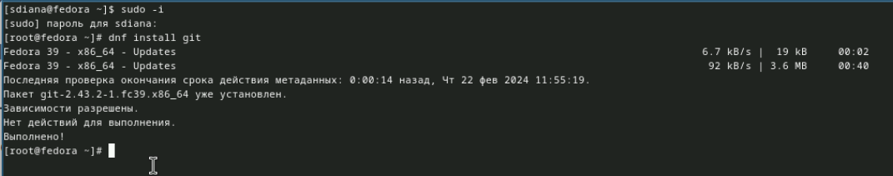{#fig:001 width=90%}

Установка завершилась, можем преступать к следующему пункту

### Установка gh

Fedora: (рис. [-@fig:002]).

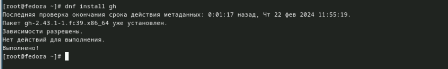{#fig:002 width=90%}

После завершения этой установки мы можем начинать работу с git

## Базовая настройка git

Зададим имя и email владельца репозитория: (рис. [-@fig:003]).

	git config --global user.name "Name Surname"
	git config --global user.email "work@mail"

Настроим utf-8 в выводе сообщений git: (рис. [-@fig:003]).

	git config --global core.quotepath false

Настройте верификацию и подписание коммитов git (см. Верификация коммитов git с помощью GPG).

Зададим имя начальной ветки (будем называть её master): (рис. [-@fig:003]).

	git config --global init.defaultBranch master

Параметр autocrlf: (рис. [-@fig:003]).

	git config --global core.autocrlf input

Параметр safecrlf: (рис. [-@fig:003]).

	git config --global core.safecrlf warn
    
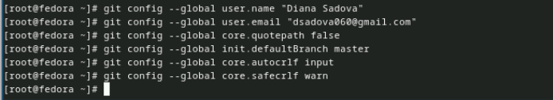{#fig:003 width=90%}

Заводим имя и email владельца, зададим имя начальной ветки, настраиваем параметры для дольнейшей работы 

## Создайте ключи ssh

по алгоритму rsa с ключём размером 4096 бит:(рис. [-@fig:004]).

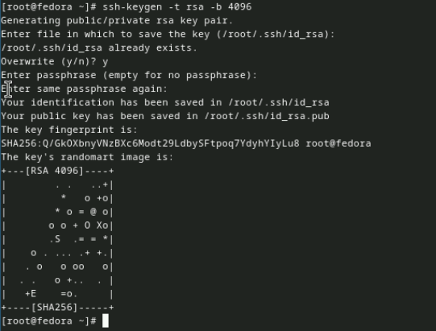{#fig:004 width=90%}

по алгоритму ed25519:(рис. [-@fig:005]).

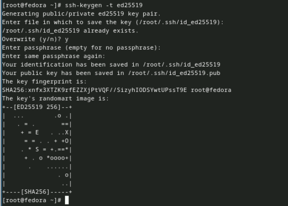{#fig:005 width=90%}

Эти ключи нам понадобятся при дальнейшим выполнение лабороторной работы 

## Создайте ключи pgp

Генерируем ключ (рис. [-@fig:006]).

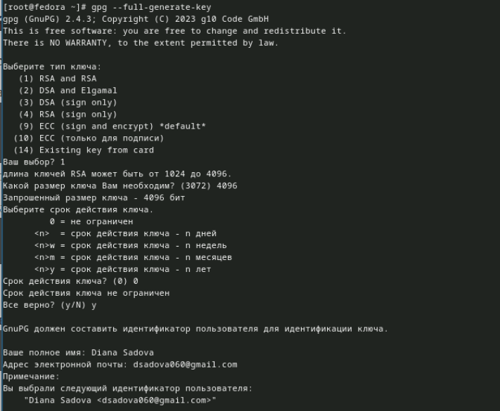{#fig:006 width=90%}

Из предложенных опций выбираем:

	тип RSA and RSA;	
	
	размер 4096;

        выберите срок действия; значение по умолчанию — 0 (срок действия не истекает никогда).

GPG запросит личную информацию, которая сохранится в ключе:

        Имя (не менее 5 символов).
        Адрес электронной почты.

        При вводе email убедитесь, что он соответствует адресу, используемому на GitHub.
            
        Комментарий. Можно ввести что угодно или нажать клавишу ввода, чтобы оставить это поле пустым. 
        (рис. [-@fig:007]).

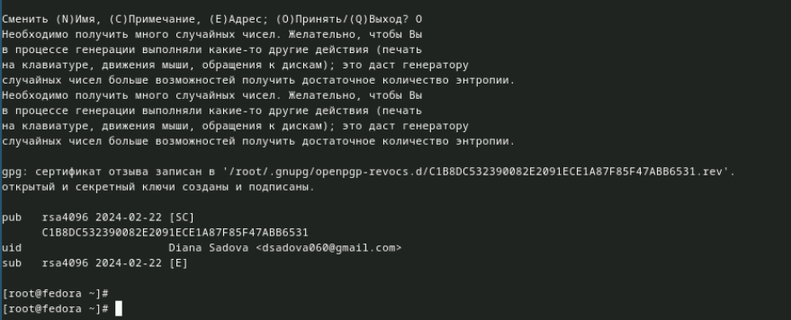{#fig:007 width=90%}

Задаем параметры для ключа и зашершаем процесс его создания

## Настройка github

    Создайте учётную запись на https://github.com.
    Заполните основные данные на https://github.com.
    (рис. [-@fig:008]).

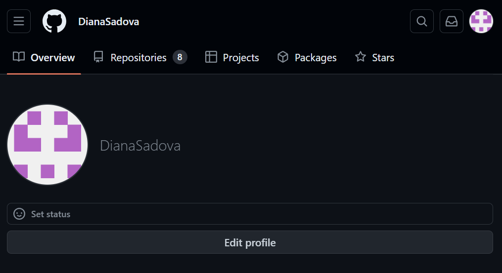{#fig:008 width=90%}

Моя учетная запись, которую я создала в прошлом семестре 

## Добавление PGP ключа в GitHub

Выводим список ключей и копируем отпечаток приватного ключа:(рис. [-@fig:009]).

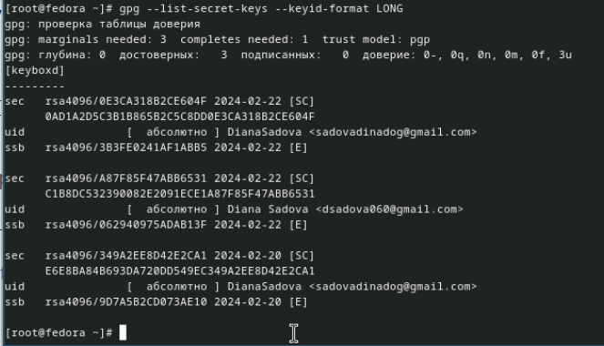{#fig:009 width=90%}

Отпечаток ключа — это последовательность байтов, используемая для идентификации более длинного, по сравнению с самим отпечатком ключа.

Формат строки:

    	sec   Алгоритм/Отпечаток_ключа Дата_создания [Флаги] [Годен_до]
          	ID_ключа

Cкопируйте ваш сгенерированный PGP ключ в буфер обмена:

    gpg --armor --export <PGP Fingerprint> | xclip -sel clip

Перейдите в настройки GitHub (https://github.com/settings/keys), нажмите на кнопку New GPG key и вставьте полученный ключ в поле ввода. (рис. [-@fig:010]),(рис. [-@fig:011]).

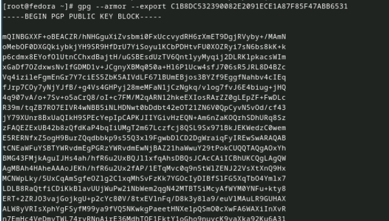{#fig:010 width=90%}

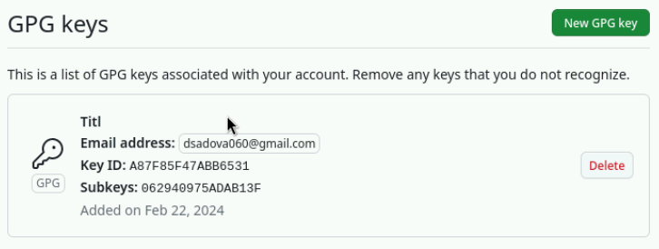{#fig:011 width=90%}

После того как мы убидились, что ключ на сайте Github, мы можем продолжить работу

## Настройка автоматических подписей коммитов git

Используя введёный email, укажите Git применять его при подписи коммитов:(рис. [-@fig:012]),(рис. [-@fig:013]),(рис. [-@fig:014]).

{#fig:012 width=90%}

{#fig:013 width=90%}

{#fig:014 width=90%}

## Настройка gh

Для начала необходимо авторизоваться(рис. [-@fig:015]).

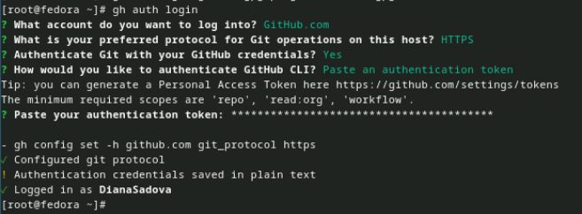{#fig:015 width=90%}

Авторизуемся с помощью token

Утилита задаст несколько наводящих вопросов.
    
Авторизоваться можно через броузер.

## Шаблон для рабочего пространства

Рабочее пространство для лабораторной работы

Репозиторий: https://github.com/yamadharma/course-directory-student-template. (рис. [-@fig:016]),(рис. [-@fig:017]).

{#fig:016 width=90%}

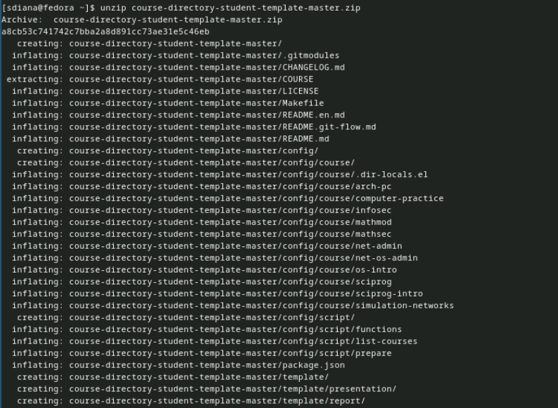{#fig:017 width=90%}

Мы создали рабочее пространство, что поможет в дальнейшей деятельности 

### Сознание репозитория курса на основе шаблона

Необходимо создать шаблон рабочего пространства (см. Рабочее пространство для лабораторной работы).

Например, для 2022–2023 учебного года и предмета «Операционные системы» (код предмета os-intro) создание репозитория примет следующий вид:(рис. [-@fig:018]),(рис. [-@fig:019]),(рис. [-@fig:020]).

{#fig:018 width=90%}

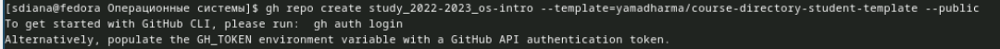{#fig:019 width=90%}

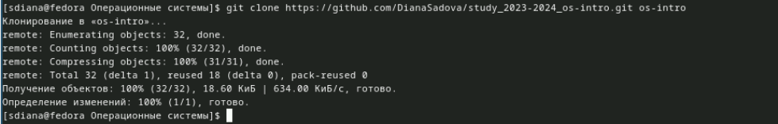{#fig:020 width=90%}

На последним шаге мы кланировали недавно созданный репридиторий "...so-intro"

### Настройка каталога курса

Перейдите в каталог курса: (рис. [-@fig:021]).

    cd ~/work/study/2022-2023/"Операционные системы"/os-intro

Удалите лишние файлы: (рис. [-@fig:021]).

    rm package.json

Создайте необходимые каталоги: (рис. [-@fig:021]).

    echo os-intro > COURSE

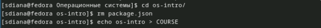{#fig:021 width=90%}

    make 

(рис. [-@fig:022]),(рис. [-@fig:023]),(рис. [-@fig:024]).

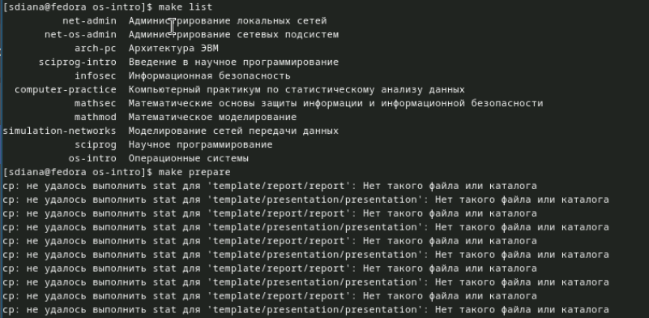{#fig:022 width=90%}

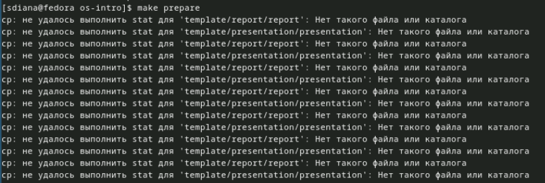{#fig:023 width=90%}

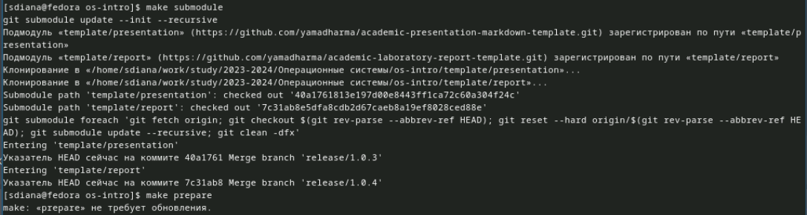{#fig:024 width=90%}

По исструкции нужно было устанавить 3 разных каталога для дольнейшей работы

Отправьте файлы на сервер: (рис. [-@fig:025]).

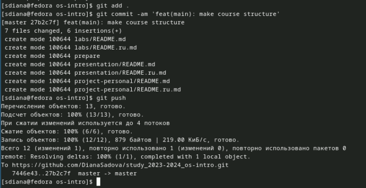{#fig:025 width=90%}

Завершаем нашу работу тем, что отправляем ее в наш репридиторий на Github

# Выводы

Изучили идеологию и применение средств контроля версий. Освоили умения по работе с git.

# Список литературы{.unnumbered}

::: {#refs}
:::
