---
## Front matter
title: "Отчёта по лабораторной работе"
subtitle: "Лабораторная работа №4"
author: "Диана Садова Алексеевна"

## Generic otions
lang: ru-RU
toc-title: "Содержание"

## Bibliography
bibliography: bib/cite.bib
csl: pandoc/csl/gost-r-7-0-5-2008-numeric.csl

## Pdf output format
toc: true # Table of contents
toc-depth: 2
lof: true # List of figures
lot: true # List of tables
fontsize: 12pt
linestretch: 1.5
papersize: a4
documentclass: scrreprt
## I18n polyglossia
polyglossia-lang:
  name: russian
  options:
	- spelling=modern
	- babelshorthands=true
polyglossia-otherlangs:
  name: english
## I18n babel
babel-lang: russian
babel-otherlangs: english
## Fonts
mainfont: PT Serif
romanfont: PT Serif
sansfont: PT Sans
monofont: PT Mono
mainfontoptions: Ligatures=TeX
romanfontoptions: Ligatures=TeX
sansfontoptions: Ligatures=TeX,Scale=MatchLowercase
monofontoptions: Scale=MatchLowercase,Scale=0.9
## Biblatex
biblatex: true
biblio-style: "gost-numeric"
biblatexoptions:
  - parentracker=true
  - backend=biber
  - hyperref=auto
  - language=auto
  - autolang=other*
  - citestyle=gost-numeric
## Pandoc-crossref LaTeX customization
figureTitle: "Рис."
tableTitle: "Таблица"
listingTitle: "Листинг"
lofTitle: "Список иллюстраций"
lotTitle: "Список таблиц"
lolTitle: "Листинги"
## Misc options
indent: true
header-includes:
  - \usepackage{indentfirst}
  - \usepackage{float} # keep figures where there are in the text
  - \floatplacement{figure}{H} # keep figures where there are in the text
---

# Цель работы

Получение навыков правильной работы с репозиториями git.

# Задание

1) Выполнить работу для тестового репозитория.

2) Преобразовать рабочий репозиторий в репозиторий с git-flow и conventional commits.

# Последовательность выполнения работы

## Установка программного обеспечения

### Установка git-flow

Linux

	Fedora
	
		Установка из коллекции репозиториев Copr (https://copr.fedorainfracloud.org/coprs/elegos/gitflow/):(рис. [-@fig:001]),(рис. [-@fig:002]).

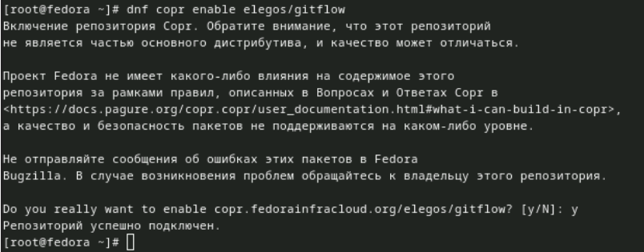{#fig:001 width=90%}

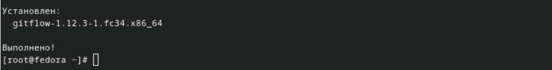{#fig:002 width=90%}

После завершения этих програм можем двигатся дальше

### Установка Node.js

На Node.js базируется программное обеспечение для семантического версионирования и общепринятых коммитов. (рис. [-@fig:003]),(рис. [-@fig:004]).

	Fedora
	
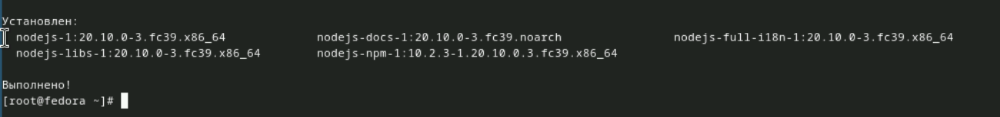{#fig:003 width=90%}

{#fig:004 width=90%}

Установка этих систем позволит выполнить данную лабораторную

### Настройка Node.js

Для работы с Node.js добавим каталог с исполняемыми файлами, устанавливаемыми yarn, в переменную PATH.

    Запустите:(рис. [-@fig:005]).

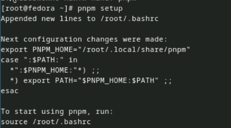{#fig:005 width=90%}

    Перелогиньтесь, или выполните:(рис. [-@fig:006]).

{#fig:006 width=90%}

### Общепринятые коммиты

    1)commitizen

        Данная программа используется для помощи в форматировании коммитов.(рис. [-@fig:007]).

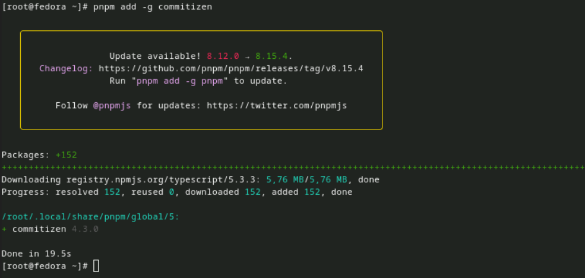{#fig:007 width=90%}

        При этом устанавливается скрипт git-cz, который мы и будем использовать для коммитов.
 
После завершения установки переходим к пункту 2

    2)standard-changelog

        Данная программа используется для помощи в создании логов.(рис. [-@fig:008]).

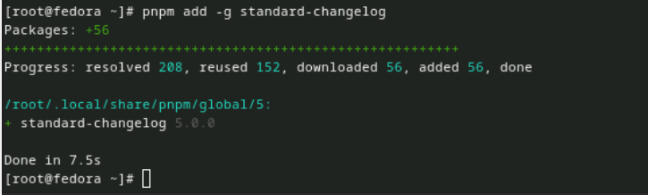{#fig:008 width=90%}

После завершения установки переходим к пункту 3

    3)Практический сценарий использования git

        1.Создание репозитория git

            1.Подключение репозитория к github

                Создайте репозиторий на GitHub. Для примера назовём его git-extended.рис. [-@fig:009]).

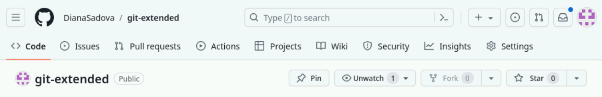{#fig:009 width=90%}

                Делаем первый коммит и выкладываем на github:(рис. [-@fig:010]).

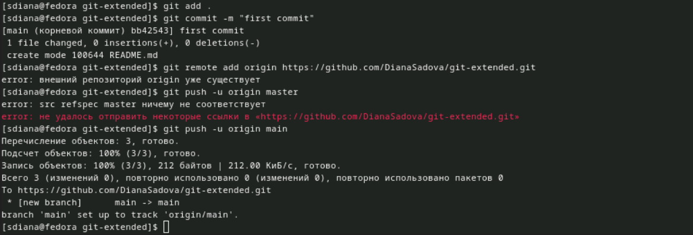{#fig:010 width=90%}

Для данного действия, я клонировала наш новый репридиторий и создала в нем файл README.md

            2.Конфигурация общепринятых коммитов

                Конфигурация для пакетов Node.js(рис. [-@fig:011]).

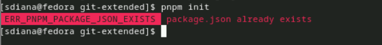{#fig:011 width=90%}

                Необходимо заполнить несколько параметров пакета.
                    Название пакета.
                    Лицензия пакета. Список лицензий для npm: https://spdx.org/licenses/. Предлагается выбирать лицензию CC-BY-4.0.

                Сконфигурим формат коммитов. Для этого добавим в файл package.json команду для формирования коммитов:

                Таким образом, файл package.json приобретает вид:(рис. [-@fig:012]).

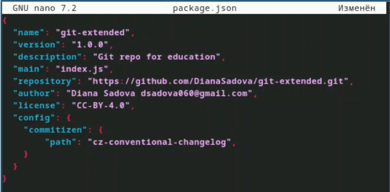{#fig:012 width=90%}

Данная процедура нам поможет при дальнейшей работе

                Добавим новые файлы:(рис. [-@fig:013]).

{#fig:013 width=90%}

                Выполним коммит:(рис. [-@fig:014]).

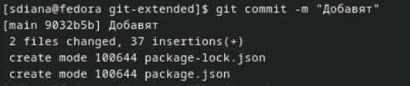{#fig:014 width=90%}

Выполняем коммит для нового файла

                Отправим на github:(рис. [-@fig:015]).

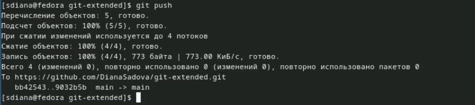{#fig:015 width=90%}

            3.Конфигурация git-flow

                Инициализируем git-flow(рис. [-@fig:016]).

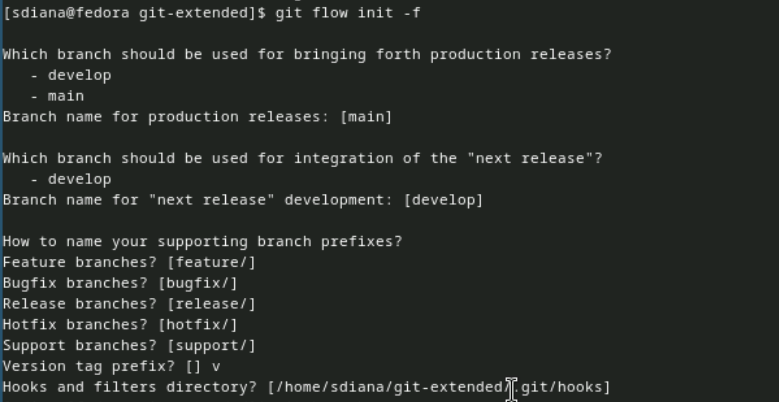{#fig:016 width=90%}

                Префикс для ярлыков установим в v.

                Проверьте, что Вы на ветке develop:(рис. [-@fig:017]).

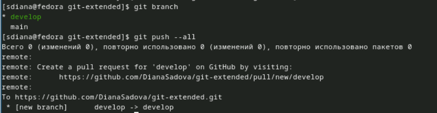{#fig:017 width=90%}

Убедились, что мы на нужной ветке, ведь в последствии она нам понадобится 

                Загрузите весь репозиторий в хранилище:(рис. [-@fig:018]).

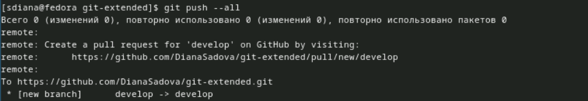{#fig:018 width=90%}

                Установите внешнюю ветку как вышестоящую для этой ветки:(рис. [-@fig:019]).

{#fig:019 width=90%}

                Создадим релиз с версией 1.0.0(рис. [-@fig:020]).

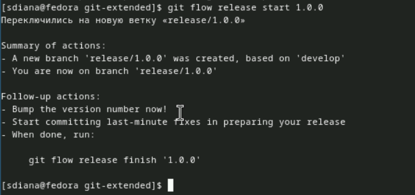{#fig:020 width=90%}

                Создадим журнал изменений(рис. [-@fig:021]).

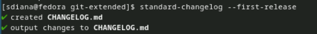{#fig:021 width=90%}

Что бы воспользоваься программой standard-changelog нужно было ее сначало установить (проверенно на собственном опыте)

                Добавим журнал изменений в индекс(рис. [-@fig:022]).

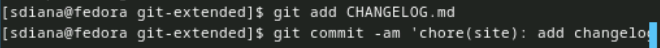{#fig:022 width=90%}

                Зальём релизную ветку в основную ветку(рис. [-@fig:023]).

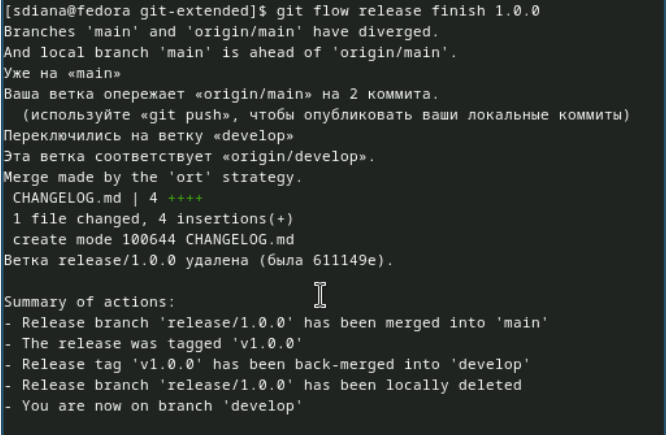{#fig:023 width=90%}

                Отправим данные на github(рис. [-@fig:024]),(рис. [-@fig:025]).

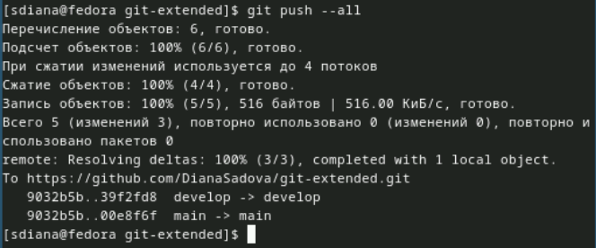{#fig:024 width=90%}

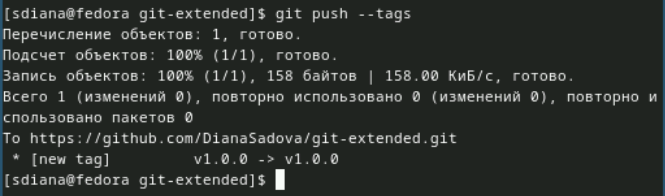{#fig:025 width=90%}

                Создадим релиз на github. Для этого будем использовать утилиты работы с github:(рис. [-@fig:026]).

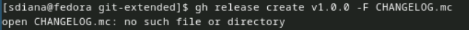{#fig:026 width=90%}

        2.Работа с репозиторием git

            1.Разработка новой функциональности

                Создадим ветку для новой функциональности:(рис. [-@fig:027]).

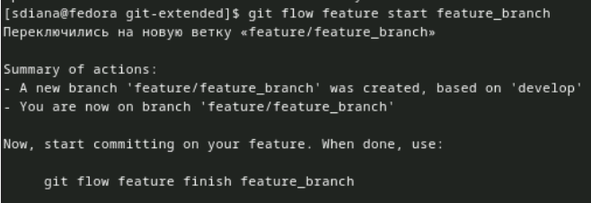{#fig:027 width=90%}

                Далее, продолжаем работу c git как обычно.

                По окончании разработки новой функциональности следующим шагом следует объединить ветку feature_branch c develop:(рис. [-@fig:028]).

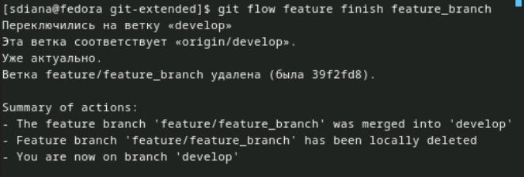{#fig:028 width=90%}

            2.Создание релиза git-flow

                Создадим релиз с версией 1.2.3:(рис. [-@fig:030]).

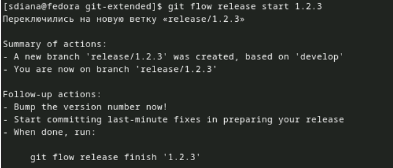{#fig:030 width=90%}

                Обновите номер версии в файле package.json. Установите её в 1.2.3.,(рис. [-@fig:029]).

{#fig:029 width=90%}

Нам понадобится это обновление, так как без него не будут работать следующие программы

                Создадим журнал изменений(рис. [-@fig:031]).

{#fig:031 width=90%}

                Добавим журнал изменений в индекс(рис. [-@fig:032]),(рис. [-@fig:033]).

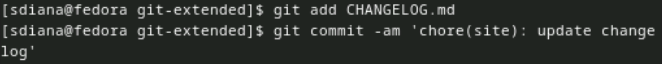{#fig:032 width=90%}

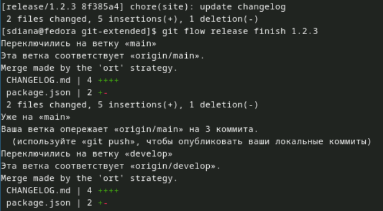{#fig:033 width=90%}

                Зальём релизную ветку в основную ветку(рис. [-@fig:034]).

{#fig:034 width=90%}

                Отправим данные на github(рис. [-@fig:035]),(рис. [-@fig:036]).

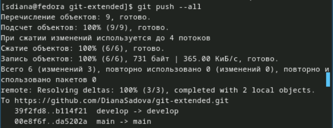{#fig:035 width=90%}

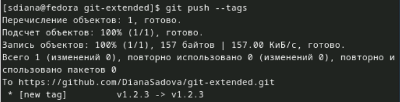{#fig:036 width=90%}

                Создадим релиз на github с комментарием из журнала изменений:(рис. [-@fig:037]).

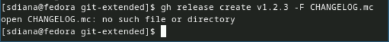{#fig:037 width=90%}

# Выводы

Получили навыки правильной работы с репозиториями git и освоили новые способы работы с ним

# Список литературы{.unnumbered}

::: {#refs}
:::
