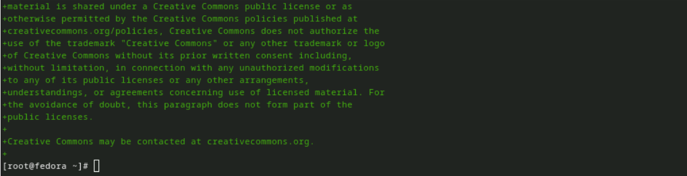
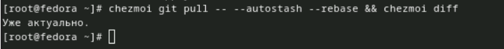
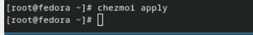

---
## Front matter
title: "Отчёта по лабораторной работе"
subtitle: "Лабораторная работа №5"
author: "Диана Садова Алексеевна"

## Generic otions
lang: ru-RU
toc-title: "Содержание"

## Bibliography
bibliography: bib/cite.bib
csl: pandoc/csl/gost-r-7-0-5-2008-numeric.csl

## Pdf output format
toc: true # Table of contents
toc-depth: 2
lof: true # List of figures
lot: true # List of tables
fontsize: 12pt
linestretch: 1.5
papersize: a4
documentclass: scrreprt
## I18n polyglossia
polyglossia-lang:
  name: russian
  options:
	- spelling=modern
	- babelshorthands=true
polyglossia-otherlangs:
  name: english
## I18n babel
babel-lang: russian
babel-otherlangs: english
## Fonts
mainfont: PT Serif
romanfont: PT Serif
sansfont: PT Sans
monofont: PT Mono
mainfontoptions: Ligatures=TeX
romanfontoptions: Ligatures=TeX
sansfontoptions: Ligatures=TeX,Scale=MatchLowercase
monofontoptions: Scale=MatchLowercase,Scale=0.9
## Biblatex
biblatex: true
biblio-style: "gost-numeric"
biblatexoptions:
  - parentracker=true
  - backend=biber
  - hyperref=auto
  - language=auto
  - autolang=other*
  - citestyle=gost-numeric
## Pandoc-crossref LaTeX customization
figureTitle: "Рис."
tableTitle: "Таблица"
listingTitle: "Листинг"
lofTitle: "Список иллюстраций"
lotTitle: "Список таблиц"
lolTitle: "Листинги"
## Misc options
indent: true
header-includes:
  - \usepackage{indentfirst}
  - \usepackage{float} # keep figures where there are in the text
  - \floatplacement{figure}{H} # keep figures where there are in the text
---

# Цель работы

Освоить работу с файловой системой и системой поролей 

# Выполнение лабораторной работы

## Менеджер паролей pass

### Установка

    Fedora

        pass(рис. [-@fig:001]).

{#fig:001 width=70%}

            gopass(рис. [-@fig:002]).

{#fig:002 width=70%}

### Настройка

    1)Ключи GPG

        Просмотр списка ключей:(рис. [-@fig:003]).

{#fig:003 width=70%}

        Если ключа нет, нужно создать новый:(рис. [-@fig:004]).

{#fig:004 width=70%}

Это был не обязательный шаг, но мы его сделали 

    2)Инициализация хранилища

        Инициализируем хранилище:(рис. [-@fig:005]).

{#fig:005 width=70%}

    3)Синхронизация с git

        Создадим структуру git:(рис. [-@fig:006]).

{#fig:006 width=70%}

### Настройка интерфейса с броузером

    Для взаимодействия с броузером используется интерфейс native messaging.
    Поэтому кроме плагина к броузеру устанавливается программа, обеспечивающая интерфейс native messaging.

    1)Плагин browserpass
        Репозиторий: https://github.com/browserpass/browserpass-extension
        Плагин для брoузера
            Плагин для Firefox: https://addons.mozilla.org/en-US/firefox/addon/browserpass-ce/.
            Плагин для Chrome/Chromium: https://chrome.google.com/webstore/detail/browserpass-ce/naepdomgkenhinolocfifgehidddafch.

        Интерфейс для взаимодействия с броузером (native messaging)
            Репозиторий: https://github.com/browserpass/browserpass-native

            Gentoo:

            emerge www-plugins/browserpass

            Fedora (рис. [-@fig:007]),(рис. [-@fig:008]).

{#fig:007 width=70%}

{#fig:008 width=70%}

### Сохранение пароля

    1)Добавить новый пароль

        Выполните:(рис. [-@fig:009]).

{#fig:009 width=70%}

            OPTIONAL DIR: необязательное имя каталога, определяющее файловую структуру для вашего хранилища паролей;
            FILENAME: имя файла, который будет использоваться для хранения пароля.

        Отобразите пароль для указанного имени файла:(рис. [-@fig:010]).

{#fig:010 width=70%}

        Замените существующий пароль:(рис. [-@fig:011]).

{#fig:011 width=70%}

## Управление файлами конфигурации

## Дополнительное программное обеспечение

    Установите дополнительное программное обеспечение:(рис. [-@fig:012]),(рис. [-@fig:013]),(рис. [-@fig:014]),(рис. [-@fig:015]),(рис. [-@fig:016]),(рис. [-@fig:017]),(рис. [-@fig:018]),(рис. [-@fig:019]),(рис. [-@fig:020]),(рис. [-@fig:021]),(рис. [-@fig:022]),(рис. [-@fig:023]).

{#fig:012 width=70%}

{#fig:013 width=70%}

{#fig:014 width=70%}

{#fig:015 width=70%}

{#fig:016 width=70%}

{#fig:017 width=70%}

{#fig:018 width=70%}

{#fig:019 width=70%}

{#fig:020 width=70%}

{#fig:021 width=70%}

{#fig:022 width=70%}

{#fig:023 width=70%}

    Установите шрифты:(рис. [-@fig:024]),(рис. [-@fig:025]),(рис. [-@fig:026]).

{#fig:024 width=70%}

{#fig:025 width=70%}

{#fig:026 width=70%}

### Установка

    Установка бинарного файла. Скрипт определяет архитектуру процессора и операционную систему и скачивает необходимый файл:

        с помощью wget:(рис. [-@fig:027]).

{#fig:027 width=70%}

### Создание собственного репозитория с помощью утилит

    Будем использовать утилиты командной строки для работы с github.

    Создадим свой репозиторий для конфигурационных файлов на основе шаблона:(рис. [-@fig:028]).

{#fig:028 width=70%}

### Подключение репозитория к своей системе

    Инициализируйте chezmoi с вашим репозиторием dotfiles:(рис. [-@fig:029]),(рис. [-@fig:030]).

{#fig:029 width=70%}

{#fig:030 width=70%}

    Проверьте, какие изменения внесёт chezmoi в домашний каталог, запустив:(рис. [-@fig:031]).

{#fig:031 width=70%}

    Если вас устраивают изменения, внесённые chezmoi, запустите:(рис. [-@fig:032]).

{#fig:032 width=70%}

### Использование chezmoi на нескольких машинах

    На второй машине инициализируйте chezmoi с вашим репозиторием dotfiles:(рис. [-@fig:033]).

{#fig:033 width=70%}

    Проверьте, какие изменения внесёт chezmoi в домашний каталог, запустив:(рис. [-@fig:034]).

{#fig:034 width=70%}

    Если вас устраивают изменения, внесённые chezmoi, запустите:(рис. [-@fig:035]).

{#fig:035 width=70%}

    При существующем каталоге chezmoi можно получить и применить последние изменения из вашего репозитория:(рис. [-@fig:036]).

{#fig:036 width=70%}

### Настройка новой машины с помощью одной команды

    Можно установить свои dotfiles на новый компьютер с помощью одной команды:(рис. [-@fig:037]).

{#fig:037 width=70%}

### Ежедневные операции c chezmoi

    Извлеките последние изменения из репозитория и примените их

        Можно извлечь изменения из репозитория и применить их одной командой:(рис. [-@fig:038]).

{#fig:038 width=70%}

        Это запускается git pull --autostash --rebase в вашем исходном каталоге, а затем chezmoi apply.

    Извлеките последние изменения из своего репозитория и посмотрите, что изменится, фактически не применяя изменения

        Выполните:(рис. [-@fig:039]).

{#fig:039 width=70%}

        Это запускается git pull --autostash --rebase в вашем исходном каталоге, а chezmoi diff затем показывает разницу между целевым состоянием, вычисленным из вашего исходного каталога, и фактическим состоянием.

        Если вы довольны изменениями, вы можете применить их:(рис. [-@fig:040]).

{#fig:040 width=70%}

    Автоматически фиксируйте и отправляйте изменения в репозиторий
        Можно автоматически фиксировать и отправлять изменения в исходный каталог в репозиторий.
        Эта функция отключена по умолчанию.

        Чтобы включить её, добавьте в файл конфигурации ~/.config/chezmoi/chezmoi.toml следующее:(рис. [-@fig:041]).

{#fig:041 width=70%}

        Всякий раз, когда в исходный каталог вносятся изменения, chezmoi фиксирует изменения с помощью автоматически сгенерированного сообщения фиксации и отправляет их в ваш репозиторий.
        Будьте осторожны при использовании autoPush. Если ваш репозиторий dotfiles является общедоступным, и вы случайно добавили секрет в виде обычного текста, этот секрет будет отправлен в ваш общедоступный репозиторий.

# Выводы

Получили новый опыт работы с репридиториями github, файловой системой и системой поролей 

# Список литературы{.unnumbered}

::: {#refs}
:::
