---
## Front matter
title: "Отчёта по лабораторной работе"
subtitle: "Лабораторная работа №6"
author: "Диана Садова Алексеевна"

## Generic otions
lang: ru-RU
toc-title: "Содержание"

## Bibliography
bibliography: bib/cite.bib
csl: pandoc/csl/gost-r-7-0-5-2008-numeric.csl

## Pdf output format
toc: true # Table of contents
toc-depth: 2
lof: true # List of figures
lot: true # List of tables
fontsize: 12pt
linestretch: 1.5
papersize: a4
documentclass: scrreprt
## I18n polyglossia
polyglossia-lang:
  name: russian
  options:
	- spelling=modern
	- babelshorthands=true
polyglossia-otherlangs:
  name: english
## I18n babel
babel-lang: russian
babel-otherlangs: english
## Fonts
mainfont: PT Serif
romanfont: PT Serif
sansfont: PT Sans
monofont: PT Mono
mainfontoptions: Ligatures=TeX
romanfontoptions: Ligatures=TeX
sansfontoptions: Ligatures=TeX,Scale=MatchLowercase
monofontoptions: Scale=MatchLowercase,Scale=0.9
## Biblatex
biblatex: true
biblio-style: "gost-numeric"
biblatexoptions:
  - parentracker=true
  - backend=biber
  - hyperref=auto
  - language=auto
  - autolang=other*
  - citestyle=gost-numeric
## Pandoc-crossref LaTeX customization
figureTitle: "Рис."
tableTitle: "Таблица"
listingTitle: "Листинг"
lofTitle: "Список иллюстраций"
lotTitle: "Список таблиц"
lolTitle: "Листинги"
## Misc options
indent: true
header-includes:
  - \usepackage{indentfirst}
  - \usepackage{float} # keep figures where there are in the text
  - \floatplacement{figure}{H} # keep figures where there are in the text
---

# Цель работы

Приобретение практических навыков взаимодействия пользователя с системой по-
средством командной строки.

# Задание

В операционной системе типа Linux взаимодействие пользователя с системой обычно осуществляется с помощью командной строки посредством построчного ввода команд. При этом обычно используется командные интерпретаторы языка shell: /bin/sh; /bin/csh; /bin/ksh.

# Последовательность выполнения работы

## Определите полное имя вашего домашнего каталога. Далее относительно этого каталога будут выполняться последующие упражнения.(рис. [-@fig:001]).

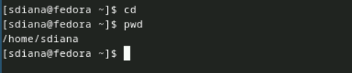{#fig:001 width=90%}

Далее можем приступать к выполнению лабораторной работы.

## Выполните следующие действия:

### Перейдите в каталог /tmp.(рис. [-@fig:002]).

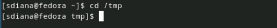{#fig:002 width=90%}

### Выведите на экран содержимое каталога /tmp. Для этого используйте команду ls с различными опциями. Поясните разницу в выводимой на экран информации.(рис. [-@fig:003]),(рис. [-@fig:004]),(рис. [-@fig:005]),(рис. [-@fig:006]).

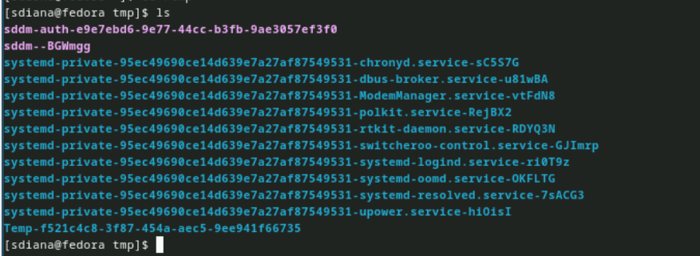{#fig:003 width=90%}

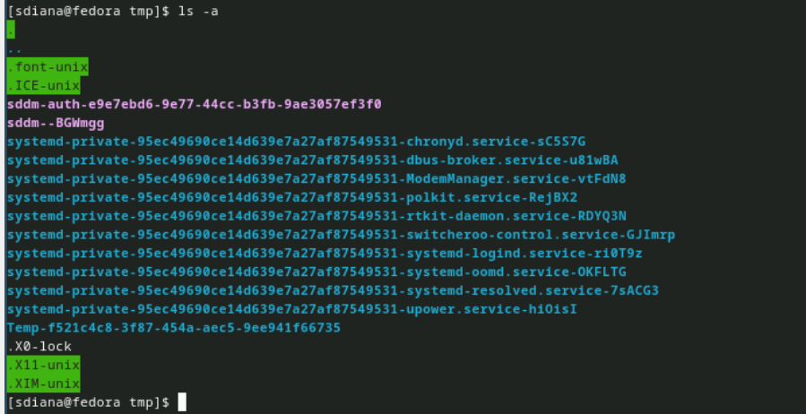{#fig:004 width=90%}

ls -a - просмотор всех файлов (скрытых в том числе).

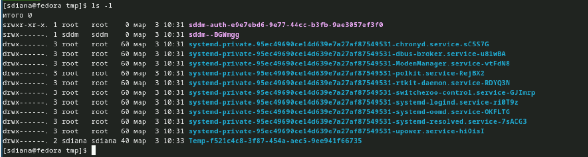{#fig:005 width=90%}

ls -l - можем посмотреть всю информацию (кто может просматривать это файл или каталог, кто и когда его создал).

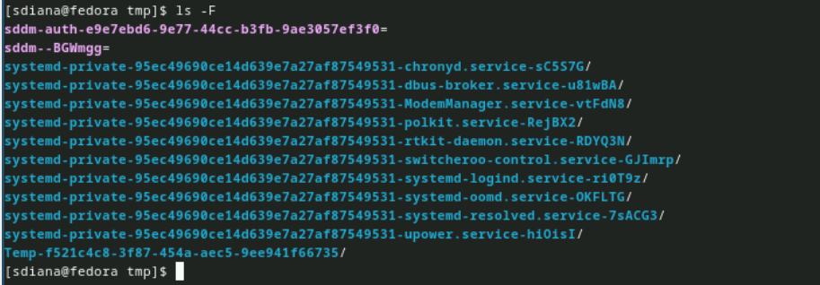{#fig:006 width=90%}

ls -F - просмотор информации о типе файлов.

### Определите, есть ли в каталоге /var/spool подкаталог с именем cron?(рис. [-@fig:007]).

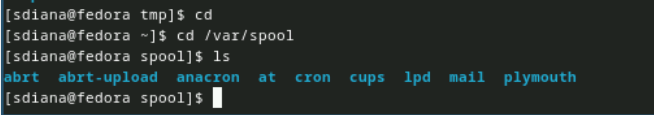{#fig:007 width=90%}

Да, он присутствует.

### Перейдите в Ваш домашний каталог и выведите на экран его содержимое. Определите, кто является владельцем файлов и подкаталогов?(рис. [-@fig:008]).

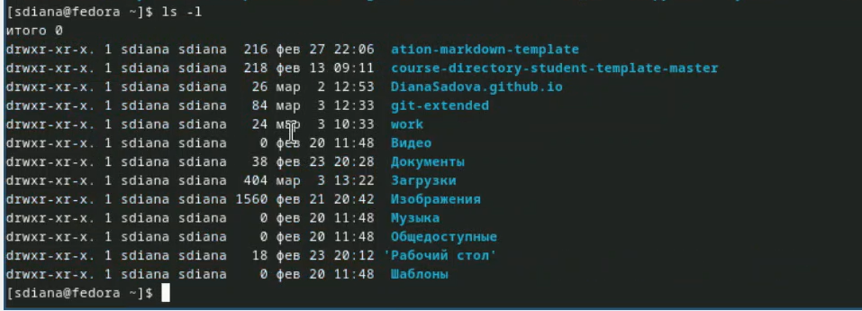{#fig:008 width=90%}

Тот кому пренадлежит учетная запись. Значит владельцем являюсь - я.

## Выполните следующие действия:

### В домашнем каталоге создайте новый каталог с именем newdir.(рис. [-@fig:009]).

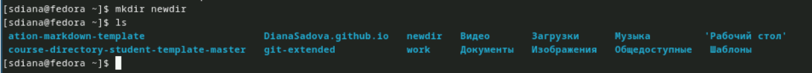{#fig:009 width=90%}

### В каталоге ~/newdir создайте новый каталог с именем morefun.(рис. [-@fig:010]).

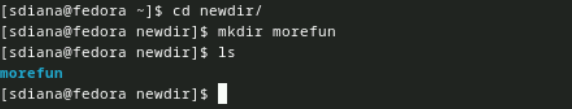{#fig:010 width=90%}

### В домашнем каталоге создайте одной командой три новых каталога с именами letters, memos, misk. Затем удалите эти каталоги одной командой.(рис. [-@fig:011]).

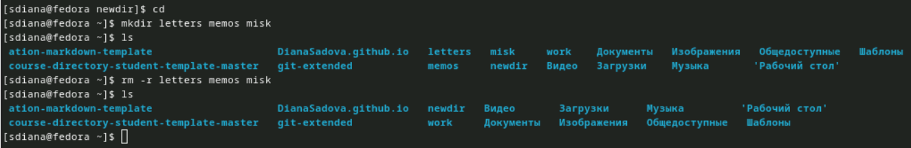{#fig:011 width=90%}

### Попробуйте удалить ранее созданный каталог ~/newdir командой rm. Проверьте, был ли каталог удалён.(рис. [-@fig:012]).

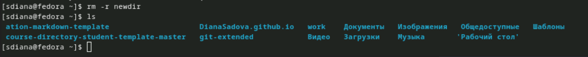{#fig:012 width=90%}

### Удалите каталог ~/newdir/morefun из домашнего каталога. Проверьте, был ли каталог удалён.(рис. [-@fig:013]).

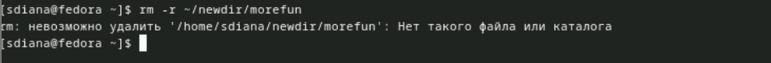{#fig:013 width=90%}

Нам выводит ошибку, так как мы уже удалили весь каталог ~/newdir. Следовательно, мы не можем удалить файл в несуществующем каталоге.

## С помощью команды man определите, какую опцию команды ls нужно использовать для просмотра содержимое не только указанного каталога, но и подкаталогов, входящих в него.(рис. [-@fig:014]).

{#fig:014 width=90%}

## С помощью команды man определите набор опций команды ls, позволяющий отсортировать по времени последнего изменения выводимый список содержимого каталога с развёрнутым описанием файлов.(рис. [-@fig:015]).

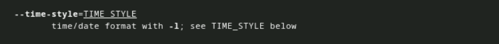{#fig:015 width=90%}

## Используйте команду man для просмотра описания следующих команд: cd, pwd, mkdir, rmdir, rm. Поясните основные опции этих команд.(рис. [-@fig:016]),(рис. [-@fig:017]),(рис. [-@fig:018]),(рис. [-@fig:019]),(рис. [-@fig:020]).

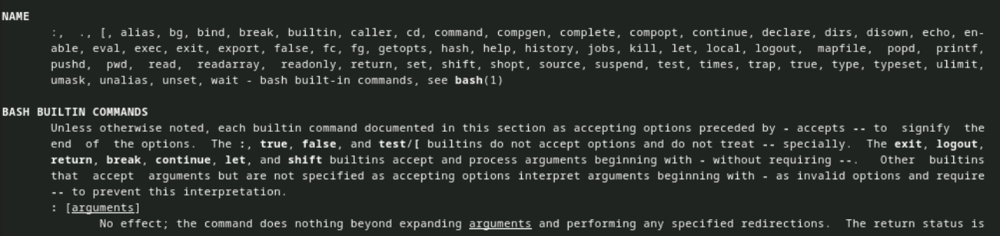{#fig:016 width=90%}

Команда cd используется для изменения текущей директории в командной строке или терминале операционной системы. При выполнении команды cd с указанием пути к желаемой, текущая рабочая директория изменяется на указанную.

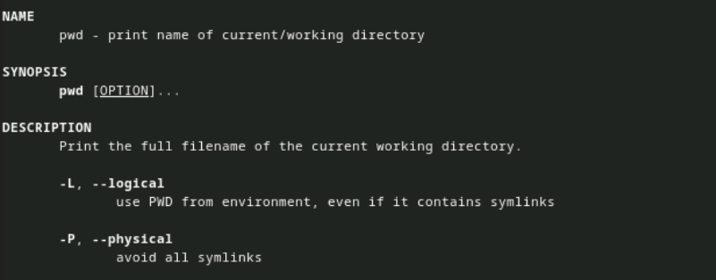{#fig:017 width=90%}

pwd — консольная утилита, которая выводит полный путь от корневого каталога к текущему рабочему каталогу: в контексте которого (по умолчанию) будут исполняться вводимые команды.

-l Использует pwd из среды, даже если он содержит символические ссылки

-P Избегать всех символических ссылок

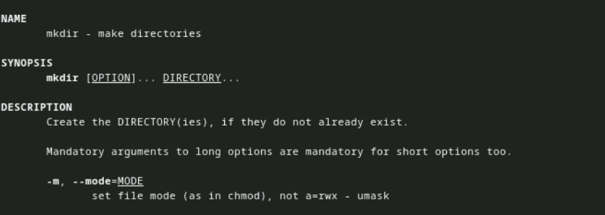{#fig:018 width=90%}

Создайте КАТАЛОГ(КАТАЛОГИ), если они еще не существуют. Обязательные аргументы для длинных опций также обязательны для коротких опций.

-m, --mode=РЕЖИМ
установки режима файла (как в chmod), а не a=rwx - umask

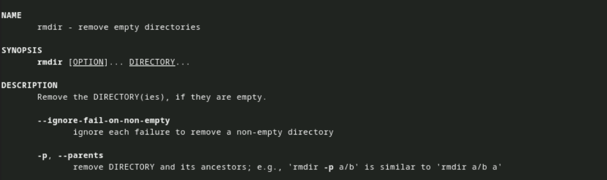{#fig:019 width=90%}

rmdir - удалить пустые каталоги. Удалите КАТАЛОГ(ы), если они пусты.

---ignore-fail-on-non-empty игнорировании каждого сбоя при удалении непустого каталога

-P, --parents. удаляют КАТАЛОГ и его предков; например, 'rmdir -p a/b' аналогично 'rmdir a/b a'

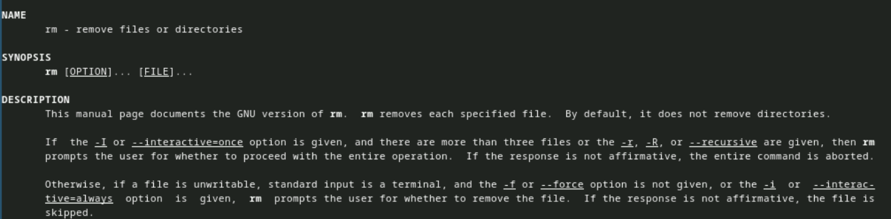{#fig:020 width=90%}

rm - удаление файлов или каталогов. rm удаляет каждый указанный файл. По умолчанию он не удаляет каталоги.

Если задан параметр -I или --interactive-once, и имеется более трех файлов, или заданы значения -1, -R или --recursive, то rm запрашивает у пользователя, следует ли продолжить всю операцию. Если ответ не является утвердительным, вся команда прерывается.

В противном случае, если файл недоступен для записи, стандартным вводом является терминал, а параметр -for -force не задан или задан параметр -i или -interact-tive-always, rm запрашивает у пользователя, следует ли удалить файл.

Если ответ не утвердительный, файл пропускается.

## Используя информацию, полученную при помощи команды history, выполните модификацию и исполнение нескольких команд из буфера команд.(рис. [-@fig:021]),(рис. [-@fig:022]),(рис. [-@fig:023]).

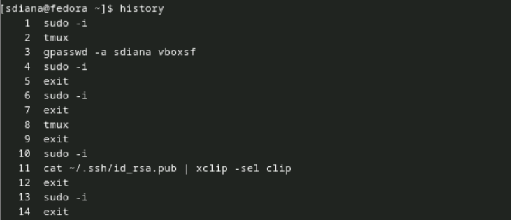{#fig:021 width=90%}

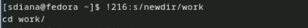{#fig:022 width=90%}

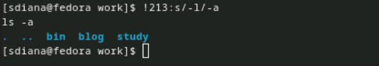{#fig:023 width=90%}

# Выводы

Приобрели практические навыки взаимодействия пользователя с системой посредством командной строки. 

# Список литературы{.unnumbered}

::: {#refs}
:::
