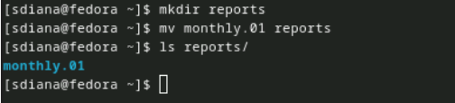

---
## Front matter
title: "Отчёта по лабораторной работе"
subtitle: "Лабораторная работа №7"
author: "Диана Садова Алексеевна"

## Generic otions
lang: ru-RU
toc-title: "Содержание"

## Bibliography
bibliography: bib/cite.bib
csl: pandoc/csl/gost-r-7-0-5-2008-numeric.csl

## Pdf output format
toc: true # Table of contents
toc-depth: 2
lof: true # List of figures
lot: true # List of tables
fontsize: 12pt
linestretch: 1.5
papersize: a4
documentclass: scrreprt
## I18n polyglossia
polyglossia-lang:
  name: russian
  options:
	- spelling=modern
	- babelshorthands=true
polyglossia-otherlangs:
  name: english
## I18n babel
babel-lang: russian
babel-otherlangs: english
## Fonts
mainfont: PT Serif
romanfont: PT Serif
sansfont: PT Sans
monofont: PT Mono
mainfontoptions: Ligatures=TeX
romanfontoptions: Ligatures=TeX
sansfontoptions: Ligatures=TeX,Scale=MatchLowercase
monofontoptions: Scale=MatchLowercase,Scale=0.9
## Biblatex
biblatex: true
biblio-style: "gost-numeric"
biblatexoptions:
  - parentracker=true
  - backend=biber
  - hyperref=auto
  - language=auto
  - autolang=other*
  - citestyle=gost-numeric
## Pandoc-crossref LaTeX customization
figureTitle: "Рис."
tableTitle: "Таблица"
listingTitle: "Листинг"
lofTitle: "Список иллюстраций"
lotTitle: "Список таблиц"
lolTitle: "Листинги"
## Misc options
indent: true
header-includes:
  - \usepackage{indentfirst}
  - \usepackage{float} # keep figures where there are in the text
  - \floatplacement{figure}{H} # keep figures where there are in the text
---

# Цель работы

Ознакомление с файловой системой Linux, её структурой, именами и содержанием каталогов. Приобретение практических навыков по применению команд для работы с файлами и каталогами, по управлению процессами (и работами), по проверке использования диска и обслуживанию файловой системы.

# Задание

## Копирование файлов и каталогов

Для выполнения лабороторной работы пункт 1, нам нужно выполнить примеры в теоритическом материале. Далее прелставленны эти примеры.

Команда cp используется для копирования файлов и каталогов.

Формат команды:

1 cp [-опции] исходный_файл целевой_файл

Примеры:

1) Копирование файла в текущем каталоге. Скопировать файл ~/abc1 в файл april и в файл may:(рис. [-@fig:001]).

{#fig:001 width=90%}

2) Копирование нескольких файлов в каталог. Скопировать файлы april и may в каталог monthly:(рис. [-@fig:002]).

{#fig:002 width=90%}

3) Копирование файлов в произвольном каталоге. Скопировать файл monthly/may в файл с именем june:(рис. [-@fig:003]).

{#fig:003 width=90%}

Опция i в команде cp выведет на экран запрос подтверждения о перезаписи файла.

Для рекурсивного копирования каталогов, содержащих файлы, используется команда cp с опцией r.

Примеры:

1) Копирование каталогов в текущем каталоге. Скопировать каталог monthly в каталог monthly.00:(рис. [-@fig:004]).

{#fig:004 width=90%}

2) Копирование каталогов в произвольном каталоге. Скопировать каталог monthly.00(рис. [-@fig:005]).

{#fig:005 width=90%}

Результат (рис. [-@fig:006]).

{#fig:006 width=90%}

## Перемещение и переименование файлов и каталогов

Команды mv и mvdir предназначены для перемещения и переименования файлов и каталогов.

Формат команды mv:

Примеры:

1) Переименование файлов в текущем каталоге. Изменить название файла april на july в домашнем каталоге:(рис. [-@fig:007]).

{#fig:007 width=90%}

2) Перемещение файлов в другой каталог. Переместить файл july в каталог monthly.00:(рис. [-@fig:008]).

{#fig:008 width=90%}

Если необходим запрос подтверждения о перезаписи файла, то нужно использовать опцию i.

3) Переименование каталогов в текущем каталоге. Переименовать каталог monthly.00 в monthly.01(рис. [-@fig:009]).

{#fig:009 width=90%}

4) Перемещение каталога в другой каталог. Переместить каталог monthly.01в каталог reports:(рис. [-@fig:010]).

{#fig:010 width=90%}

5) Переименование каталога, не являющегося текущим. Переименовать каталог reports/monthly.01 в reports/monthly:(рис. [-@fig:011]).

{#fig:011 width=90%}

## Изменение прав доступа

Примеры:

1) Требуется создать файл ~/may с правом выполнения для владельца:(рис. [-@fig:012]).

{#fig:012 width=90%}

2_ Требуется лишить владельца файла ~/may права на выполнение:(рис. [-@fig:013]).

{#fig:013 width=90%}

3) Требуется создать каталог monthly с запретом на чтение для членов группы и всех остальных пользователей:(рис. [-@fig:014]).

{#fig:014 width=90%}

Результат (рис. [-@fig:015]).

{#fig:015 width=90%}

4) Требуется создать файл ~/abc1 с правом записи для членов группы:(рис. [-@fig:016]).

{#fig:016 width=90%}

# Последовательность выполнения работы

## Выполните все примеры, приведённые в первой части описания лабораторной работы.

## Выполните следующие действия, зафиксировав в отчёте по лабораторной работе используемые при этом команды и результаты их выполнения:

1) Скопируйте файл /usr/include/sys/io.h в домашний каталог и назовите его equipment. Если файла io.h нет, то используйте любой другой файл в каталоге /usr/include/sys/ вместо него.(рис. [-@fig:017]),(рис. [-@fig:018]).

{#fig:017 width=90%}

{#fig:018 width=90%}

2) В домашнем каталоге создайте директорию ~/ski.plases.(рис. [-@fig:019]).

{#fig:019 width=90%}

3) Переместите файл equipment в каталог ~/ski.plases.(рис. [-@fig:020]).

{#fig:020 width=90%}

4) Переименуйте файл ~/ski.plases/equipment в ~/ski.plases/equiplist.(рис. [-@fig:021]).

{#fig:021 width=90%}

5) Создайте в домашнем каталоге файл abc1 и скопируйте его в каталог ~/ski.plases, назовите его equiplist2.(рис. [-@fig:022]).

{#fig:022 width=90%}

6) Создайте каталог с именем equipment в каталоге ~/ski.plases.(рис. [-@fig:023]).

{#fig:023 width=90%}

7) Переместите файлы ~/ski.plases/equiplist и equiplist2 в каталог ~/ski.plases/equipment.(рис. [-@fig:024]).

{#fig:024 width=90%}

8) Создайте и переместите каталог ~/newdir в каталог ~/ski.plases и назовите его plans.(рис. [-@fig:025]),(рис. [-@fig:026]).

{#fig:025 width=90%}

Создаем каталог и смотрим, что он есть

{#fig:026 width=90%}

## Определите опции команды chmod, необходимые для того, чтобы присвоить перечисленным ниже файлам выделенные права доступа, считая, что в начале таких прав нет:

Для того, что бы не искать все файла на забитом рабочем столе для присутствует и там много каталогов, я создала отдельную папку со всеми файлами. В ней мы продолжим работу

3.1. drwxr--r-- ... australia
3.2. drwx--x--x ... play
3.3. -r-xr--r-- ... my_os
3.4. -rw-rw-r-- ... feathers
При необходимости создайте нужные файлы.(рис. [-@fig:027]),(рис. [-@fig:028]),(рис. [-@fig:029]),(рис. [-@fig:030]),(рис. [-@fig:031]).

{#fig:027 width=90%}

{#fig:028 width=90%}

{#fig:029 width=90%}

{#fig:030 width=90%}

{#fig:031 width=90%}

## Проделайте приведённые ниже упражнения, записывая в отчёт по лабораторной работе используемые при этом команды:

1) Просмотрите содержимое файла /etc/password.(рис. [-@fig:032]).

{#fig:032 width=90%}

2) Скопируйте файл ~/feathers в файл ~/file.old.(рис. [-@fig:033]).

{#fig:033 width=90%}

3) Переместите файл ~/file.old в каталог ~/play.(рис. [-@fig:034]).

{#fig:034 width=90%}

4) Скопируйте каталог ~/play в каталог ~/fun.(рис. [-@fig:035]).

{#fig:035 width=90%}

5) Переместите каталог ~/fun в каталог ~/play и назовите его games.(рис. [-@fig:036),(рис. [-@fig:037).

{#fig:036 width=90%}

{#fig:037 width=90%}

6) Лишите владельца файла ~/feathers права на чтение.(рис. [-@fig:038]).

{#fig:038 width=90%}

Результат (рис. [-@fig:039]).

{#fig:039 width=90%}

7) Что произойдёт, если вы попытаетесь просмотреть файл ~/feathers командой cat?(рис. [-@fig:040]).

{#fig:040 width=90%}

Нечего не происходит, так как мы зарпетили читать этот файл.

8) Что произойдёт, если вы попытаетесь скопировать файл ~/feathers?(рис. [-@fig:041]).

{#fig:041 width=90%}

Мы можем это сделать так как мы все еще можем взаимодействовать с файлом

9) Дайте владельцу файла ~/feathers право на чтение.(рис. [-@fig:042]).

{#fig:042 width=90%}

Результат (рис. [-@fig:043]).

{#fig:043 width=90%}

10) Лишите владельца каталога ~/play права на выполнение.(рис. [-@fig:044]).

{#fig:044 width=90%}

Результат (рис. [-@fig:045]).

{#fig:045 width=90%}

11) Перейдите в каталог ~/play. Что произошло?(рис. [-@fig:046]).

{#fig:046 width=90%}

12) Дайте владельцу каталога ~/play право на выполнение.(рис. [-@fig:047]).

{#fig:047 width=90%}

## Прочитайте man по командам mount, fsck, mkfs, kill и кратко их охарактеризуйте, приведя примеры (рис. [-@fig:048]),(рис. [-@fig:049]),(рис. [-@fig:050]),(рис. [-@fig:051]).

{#fig:048 width=90%}

монтировать - монтирует файловую систему

монтирования [-h|-V]

монтировать [-1] [-t fstype]

монтировать -a [-fFnrsvw] [-t fstype] [-0 список опций]

{#fig:049 width=90%}

fsck - проверка и восстановление файловой системы Linux

fsck [-savrtmnp] [-x [fd]] [-C [fd]] [-t fstype] [файловая система...] [--] [параметры, специфичные для fs]

ОПИСАНИЕ

fsck используется для проверки и необязательного восстановления одной или нескольких файловых систем Linux, файловой системой может быть имя устройства (например, /dev/hdc1, /dev/sdb2), точка монтирования (например, /usr, /home) или метка файловой системы или спецификатор UUID 

{#fig:050 width=90%}

mkfs - создание файловой системы Linux mkfs [параметры] [-t тип] [fs-параметры] устройство [размер]

описание

Этот интерфейс mkfs устарел в пользу mkfs, специфичных для файловой системы.<тип> утилиты.

{#fig:051 width=90%}

kill - завершение процесса

kill [-сигнал|-s сигнал|-p] [-значение q] [-a] [--сигнал в миллисекундах ожидания] [--] pid|имя…

kill -1 [число] | -L

# Выводы

Ознакомлись с файловой системой Linux, её структурой, именами и содержанием каталогов. Приобрели практические навыки по применению команд для работы с файлами и каталогами, по управлению процессами (и работами), по проверке использования диска и обслуживанию файловой системы.

# Список литературы{.unnumbered}

::: {#refs}
:::
