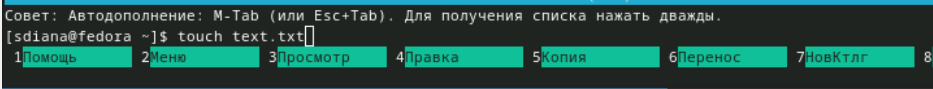

---
## Front matter
title: "Отчёта по лабораторной работе"
subtitle: "Лабораторная работа №9"
author: "Диана Садова Алексеевна"

## Generic otions
lang: ru-RU
toc-title: "Содержание"

## Bibliography
bibliography: bib/cite.bib
csl: pandoc/csl/gost-r-7-0-5-2008-numeric.csl

## Pdf output format
toc: true # Table of contents
toc-depth: 2
lof: true # List of figures
lot: true # List of tables
fontsize: 12pt
linestretch: 1.5
papersize: a4
documentclass: scrreprt
## I18n polyglossia
polyglossia-lang:
  name: russian
  options:
	- spelling=modern
	- babelshorthands=true
polyglossia-otherlangs:
  name: english
## I18n babel
babel-lang: russian
babel-otherlangs: english
## Fonts
mainfont: PT Serif
romanfont: PT Serif
sansfont: PT Sans
monofont: PT Mono
mainfontoptions: Ligatures=TeX
romanfontoptions: Ligatures=TeX
sansfontoptions: Ligatures=TeX,Scale=MatchLowercase
monofontoptions: Scale=MatchLowercase,Scale=0.9
## Biblatex
biblatex: true
biblio-style: "gost-numeric"
biblatexoptions:
  - parentracker=true
  - backend=biber
  - hyperref=auto
  - language=auto
  - autolang=other*
  - citestyle=gost-numeric
## Pandoc-crossref LaTeX customization
figureTitle: "Рис."
tableTitle: "Таблица"
listingTitle: "Листинг"
lofTitle: "Список иллюстраций"
lotTitle: "Список таблиц"
lolTitle: "Листинги"
## Misc options
indent: true
header-includes:
  - \usepackage{indentfirst}
  - \usepackage{float} # keep figures where there are in the text
  - \floatplacement{figure}{H} # keep figures where there are in the text
---

# Цель работы

Освоение основных возможностей командной оболочки Midnight Commander. Приобретение навыков практической работы по просмотру каталогов и файлов; манипуляций с ними.

# Задание по встроенному редактору mc

1) Создайте текстовой файл text.txt.(рис. [-@fig:001]),(рис. [-@fig:002]).

{#fig:001 width=90%}

{#fig:002 width=90%}

2) Откройте этот файл с помощью встроенного в mc редактора.(рис. [-@fig:003]).

{#fig:003 width=90%}

3) Вставьте в открытый файл небольшой фрагмент текста, скопированный из любого другого файла или Интернета.(рис. [-@fig:004]).

{#fig:004 width=90%}

Я напечатала текст из головы

4) Проделайте с текстом следующие манипуляции, используя горячие клавиши:

	4.1. Удалите строку текста.(рис. [-@fig:005]).

{#fig:005 width=90%}

	Удалили строку "May i"

	4.2. Выделите фрагмент текста и скопируйте его на новую строку.(рис. [-@fig:006]).

{#fig:006 width=90%}

	Скопировали строку "May"

	4.3. Выделите фрагмент текста и перенесите его на новую строку.(рис. [-@fig:007]).

{#fig:007 width=90%}

	Перенесли строку "May hi"

	4.4. Сохраните файл.(рис. [-@fig:008]).

{#fig:008 width=90%}

	4.5. Отмените последнее действие.(рис. [-@fig:009]).

{#fig:009 width=90%}

	В последний раз я написала строку "May holla" и удалила ее. Отменив последние действие я ее вернула

	4.6. Перейдите в конец файла (нажав комбинацию клавиш) и напишите некоторый текст.(рис. [-@fig:010]).

{#fig:010 width=90%}

	4.7. Перейдите в начало файла (нажав комбинацию клавиш) и напишите некоторый текст.(рис. [-@fig:011]).

{#fig:011 width=90%}

	4.8. Сохраните и закройте файл.(рис. [-@fig:012]).

{#fig:012 width=90%}

5) Откройте файл с исходным текстом на некотором языке программирования (например C или Java)(рис. [-@fig:013]).

{#fig:013 width=90%}

В моем случае, я открыла файл на С

6) Используя меню редактора, включите подсветку синтаксиса, если она не включена, или выключите, если она включена.(рис. [-@fig:001]).

{#fig:014 width=90%}
# Выводы

Освояли основные возможности командной оболочки Midnight Commander. Приобрели навыки практической работы по просмотру каталогов и файлов; манипуляций с ними.

# Список литературы{.unnumbered}

::: {#refs}
:::
