---
## Front matter
title: "Отчёта по лабораторной работе"
subtitle: "Лабораторная работа №10"
author: "Диана Садова Алексеевна"

## Generic otions
lang: ru-RU
toc-title: "Содержание"

## Bibliography
bibliography: bib/cite.bib
csl: pandoc/csl/gost-r-7-0-5-2008-numeric.csl

## Pdf output format
toc: true # Table of contents
toc-depth: 2
lof: true # List of figures
lot: true # List of tables
fontsize: 12pt
linestretch: 1.5
papersize: a4
documentclass: scrreprt
## I18n polyglossia
polyglossia-lang:
  name: russian
  options:
	- spelling=modern
	- babelshorthands=true
polyglossia-otherlangs:
  name: english
## I18n babel
babel-lang: russian
babel-otherlangs: english
## Fonts
mainfont: PT Serif
romanfont: PT Serif
sansfont: PT Sans
monofont: PT Mono
mainfontoptions: Ligatures=TeX
romanfontoptions: Ligatures=TeX
sansfontoptions: Ligatures=TeX,Scale=MatchLowercase
monofontoptions: Scale=MatchLowercase,Scale=0.9
## Biblatex
biblatex: true
biblio-style: "gost-numeric"
biblatexoptions:
  - parentracker=true
  - backend=biber
  - hyperref=auto
  - language=auto
  - autolang=other*
  - citestyle=gost-numeric
## Pandoc-crossref LaTeX customization
figureTitle: "Рис."
tableTitle: "Таблица"
listingTitle: "Листинг"
lofTitle: "Список иллюстраций"
lotTitle: "Список таблиц"
lolTitle: "Листинги"
## Misc options
indent: true
header-includes:
  - \usepackage{indentfirst}
  - \usepackage{float} # keep figures where there are in the text
  - \floatplacement{figure}{H} # keep figures where there are in the text
---

# Цель работы

Познакомиться с операционной системой Linux. Получить практические навыки работы с редактором vi, установленным по умолчанию практически во всех дистрибутивах

# Последовательность выполнения работы

1) Ознакомиться с теоретическим материалом.

2) Ознакомиться с редактором vi.

3) Выполнить упражнения, используя команды vi.

## Задание 1. Создание нового файла с использованием vi

1) Создайте каталог с именем ~/work/os/lab06.(рис. [-@fig:001]).

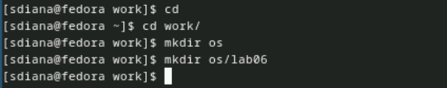{#fig:001 width=90%}

2) Перейдите во вновь созданный каталог.(рис. [-@fig:002]).

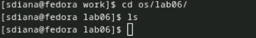{#fig:002 width=90%}

3) Вызовите vi и создайте файл hello.sh(рис. [-@fig:003]).

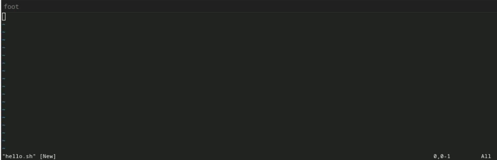{#fig:003 width=90%}

4) Нажмите клавишу i и вводите следующий текст.(рис. [-@fig:004]).

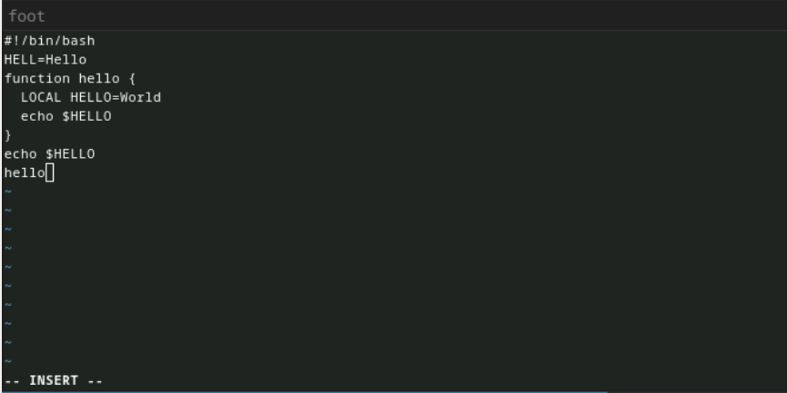{#fig:004 width=90%}

5) Нажмите клавишу Esc для перехода в командный режим после завершения ввода текста.(рис. [-@fig:005]).

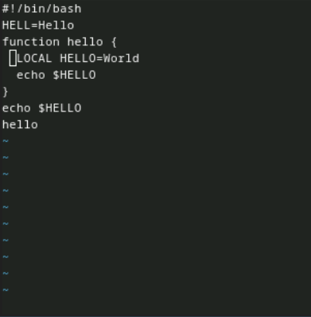{#fig:005 width=90%}

6) Нажмите: для перехода в режим последней строки и внизу вашего экрана появится приглашение в виде двоеточия.(рис. [-@fig:006])

7) Нажмите w (записать) и q (выйти), а затем нажмите клавишу Enter для сохранения вашего текста и завершения работы.(рис. [-@fig:006]).

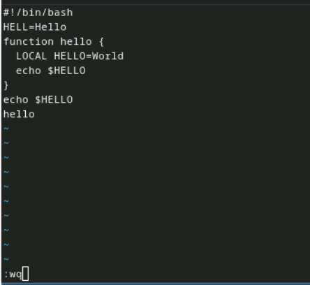{#fig:006 width=90%}

8) Сделайте файл исполняемым(рис. [-@fig:007]).

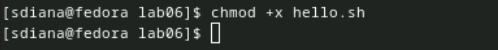{#fig:007 width=90%}

## Задание 2. Редактирование существующего файла

1) Вызовите vi на редактирование файла(рис. [-@fig:008]),(рис. [-@fig:009]).

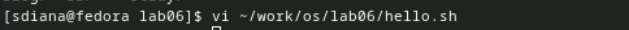{#fig:008 width=90%}

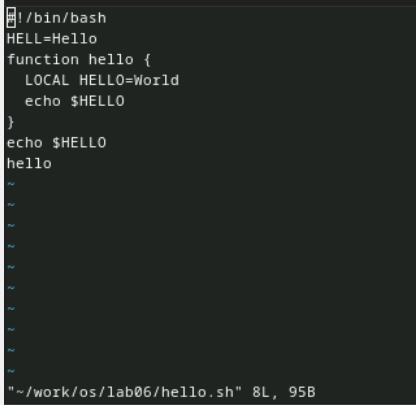{#fig:009 width=90%}

2) Установите курсор в конец слова HELL второй строки.(рис. [-@fig:010]).

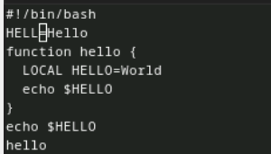{#fig:010 width=90%}

3) Перейдите в режим вставки и замените на HELLO. Нажмите Esc для возврата в командный режим.(рис. [-@fig:011]).

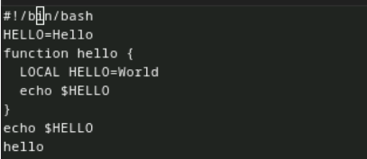{#fig:011 width=90%}

4) Установите курсор на четвертую строку и сотрите слово LOCAL.(рис. [-@fig:012]),(рис. [-@fig:013]).

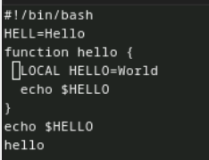{#fig:012 width=90%}

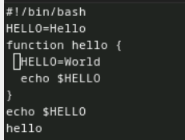{#fig:013 width=90%}

5) Перейдите в режим вставки и наберите следующий текст: local, нажмите Esc для возврата в командный режим.(рис. [-@fig:014]).

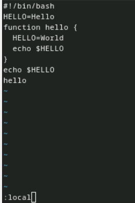{#fig:014 width=90%}

6) Установите курсор на последней строке файла. Вставьте после неё строку, содержащую следующий текст: echo $HELLO.(рис. [-@fig:015]).

{#fig:015 width=90%}

7) Нажмите Esc для перехода в командный режим.(рис. [-@fig:016]).

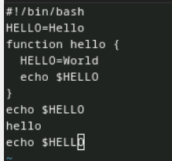{#fig:016 width=90%}

8) Удалите последнюю строку.(рис. [-@fig:017]).

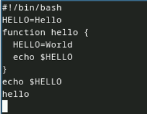{#fig:017 width=90%}

9) Введите команду отмены изменений u для отмены последней команды.(рис. [-@fig:018]).

{#fig:018 width=90%}

10) Введите символ: для перехода в режим последней строки. Запишите произведённые изменения и выйдите из vi(рис. [-@fig:019]).

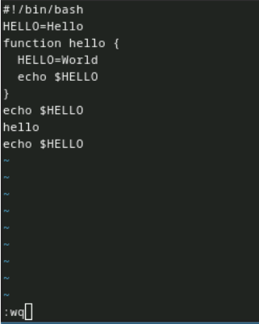{#fig:019 width=90%}

# Выводы

Познакомились с операционной системой Linux. Получили практические навыки работы с редактором vi, установленным по умолчанию практически во всех дистрибутивах

# Список литературы{.unnumbered}

::: {#refs}
:::
