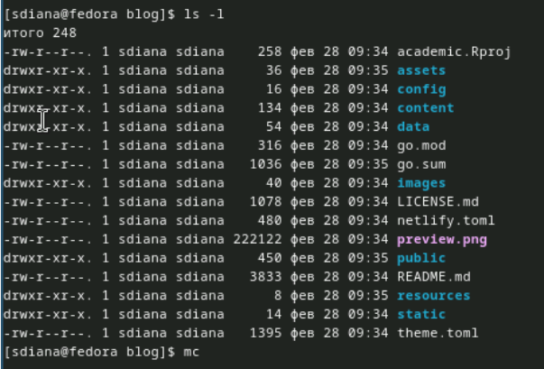

---
## Front matter
title: "Отчёт о выполнении. Индивидуальный проект. Этап 1"
subtitle: "Простейший вариант"
author: "Диана Садова Алексеевна"

## Generic otions
lang: ru-RU
toc-title: "Содержание"

## Bibliography
bibliography: bib/cite.bib
csl: pandoc/csl/gost-r-7-0-5-2008-numeric.csl

## Pdf output format
toc: true # Table of contents
toc-depth: 2
lof: true # List of figures
lot: true # List of tables
fontsize: 12pt
linestretch: 1.5
papersize: a4
documentclass: scrreprt
## I18n polyglossia
polyglossia-lang:
  name: russian
  options:
	- spelling=modern
	- babelshorthands=true
polyglossia-otherlangs:
  name: english
## I18n babel
babel-lang: russian
babel-otherlangs: english
## Fonts
mainfont: PT Serif
romanfont: PT Serif
sansfont: PT Sans
monofont: PT Mono
mainfontoptions: Ligatures=TeX
romanfontoptions: Ligatures=TeX
sansfontoptions: Ligatures=TeX,Scale=MatchLowercase
monofontoptions: Scale=MatchLowercase,Scale=0.9
## Biblatex
biblatex: true
biblio-style: "gost-numeric"
biblatexoptions:
  - parentracker=true
  - backend=biber
  - hyperref=auto
  - language=auto
  - autolang=other*
  - citestyle=gost-numeric
## Pandoc-crossref LaTeX customization
figureTitle: "Рис."
tableTitle: "Таблица"
listingTitle: "Листинг"
lofTitle: "Список иллюстраций"
lotTitle: "Список таблиц"
lolTitle: "Листинги"
## Misc options
indent: true
header-includes:
  - \usepackage{indentfirst}
  - \usepackage{float} # keep figures where there are in the text
  - \floatplacement{figure}{H} # keep figures where there are in the text
---

# Цель работы

Выполнить работу по теме "Индивидуальный проект. Этап 1"

# Задание

Размещение на Github pages заготовки для персонального сайта.

    1)Установить необходимое программное обеспечение.
    
    2)Скачать шаблон темы сайта.
    
    3)Разместить его на хостинге git.
    
    4)Установить параметр для URLs сайта.
    
    5)Разместить заготовку сайта на Github pages.

# Техническая реализация проекта

    Для реализации сайта используется генератор статических сайтов Hugo.
    
    Общие файлы для тем Wowchemy:
    
        Репозиторий: https://github.com/wowchemy/wowchemy-hugo-themes
        
    В качестве шаблона индивидуального сайта используется шаблон Hugo Academic Theme.
        Демо-сайт: https://academic-demo.netlify.app/
        
        Репозиторий: https://github.com/wowchemy/starter-hugo-academic

# Выполнение индивидуального проекта 

Скачиваем исполняемый файл Hugo для генерации страниц сайта. Скачиваем нужную нам версию для дальнейшей работы ( важно установить файл с расширением tar.gz ). С помощью тереминала распаковываем архив (рис. [-@fig:001]),(рис. [-@fig:002]).

{#fig:001 width=90%}

{#fig:002 width=90%}

Создаем папку bin и переносим в нее наш исполсяемый файл hugo(рис. [-@fig:003]).

{#fig:003 width=90%}

Создаем копию репридитория из шадлонов, которые мы берем из технической реализации проекта. Создаем наш репридиторий с именем blog.(рис. [-@fig:004]).

{#fig:004 width=90%}

Клонируем новосозданного репридитория в нужной папке и проверяем его наличие (рис. [-@fig:005]).

{#fig:005 width=90%}

Переходим в папку blog и оттуда запускаем исполняемый файл hugo(рис. [-@fig:006]).

{#fig:006 width=90%}

Проверяем какие файлы создались и удаляем папку public ( мы потом самостоятельно ее создадим )(рис. [-@fig:007]).

{#fig:007 width=90%}

Из папаки blog запустаем hugo server для провереки того, что мы можем зайти на свой сайт (рис. [-@fig:008]), (рис. [-@fig:009]).

{#fig:008 width=90%}

{#fig:009 width=90%}

Создаем репридиторий с особыс названием ( в нем мы будем хранить наш сайт )(рис. [-@fig:010]).

{#fig:010 width=90%}

Клонируем репридиторий на рабочий стол и проверяем его наличие (рис. [-@fig:011]).

{#fig:011 width=90%}

Переходим в io. и создаем новый файл README.md ( Создаем для добывления в репридиторий io, чтобы тот не был пуст)(рис. [-@fig:012]).

{#fig:012 width=90%}

Отправляем файл на репридиторий (рис. [-@fig:013]).

{#fig:013 width=90%}

git push origin main - Отправление файлов именно на ветку main

Возвращаемся к папке blog и подключаем к ней реприлиторий io. (рис. [-@fig:014]).

{#fig:014 width=90%}

Коментируем public, чтобы он смог подключится к репридиторию io. Проверяем что public закоментирован (рис. [-@fig:015]).

{#fig:015 width=90%}

Кланируем наш репридиторий io с папкой public (рис. [-@fig:016]).

{#fig:016 width=90%}

Запускаем исполняемый файл hugo для добовления в новосозданную папку public нужной информации (рис. [-@fig:017]).

{#fig:017 width=90%}

Переходим в папку public и проверяем какой репридиторий подключен к этой папке (рис. [-@fig:018]).

{#fig:018 width=90%}

Отправляем файлы на репридиторий io. (рис. [-@fig:019])(рис. [-@fig:020]).

{#fig:019 width=90%}

{#fig:020 width=90%}

Проверяем наличие файлов на репридитори (рис. [-@fig:021]).

{#fig:021 width=90%}

Проверяем, что наш сайт по имени репридитория существует (рис. [-@fig:022]).

{#fig:022 width=90%}

# Выводы

Выполнили работу по теме "Индивидуальный проект. Этап 1"

# Список литературы{.unnumbered}

::: {#refs}
:::
