---
## Front matter
title: "Отчёт о выполнении. Индивидуальный проект. Этап 2"
subtitle: "Простейший вариант"
author: "Диана Садова Алексеевна"

## Generic otions
lang: ru-RU
toc-title: "Содержание"

## Bibliography
bibliography: bib/cite.bib
csl: pandoc/csl/gost-r-7-0-5-2008-numeric.csl

## Pdf output format
toc: true # Table of contents
toc-depth: 2
lof: true # List of figures
lot: true # List of tables
fontsize: 12pt
linestretch: 1.5
papersize: a4
documentclass: scrreprt
## I18n polyglossia
polyglossia-lang:
  name: russian
  options:
	- spelling=modern
	- babelshorthands=true
polyglossia-otherlangs:
  name: english
## I18n babel
babel-lang: russian
babel-otherlangs: english
## Fonts
mainfont: PT Serif
romanfont: PT Serif
sansfont: PT Sans
monofont: PT Mono
mainfontoptions: Ligatures=TeX
romanfontoptions: Ligatures=TeX
sansfontoptions: Ligatures=TeX,Scale=MatchLowercase
monofontoptions: Scale=MatchLowercase,Scale=0.9
## Biblatex
biblatex: true
biblio-style: "gost-numeric"
biblatexoptions:
  - parentracker=true
  - backend=biber
  - hyperref=auto
  - language=auto
  - autolang=other*
  - citestyle=gost-numeric
## Pandoc-crossref LaTeX customization
figureTitle: "Рис."
tableTitle: "Таблица"
listingTitle: "Листинг"
lofTitle: "Список иллюстраций"
lotTitle: "Список таблиц"
lolTitle: "Листинги"
## Misc options
indent: true
header-includes:
  - \usepackage{indentfirst}
  - \usepackage{float} # keep figures where there are in the text
  - \floatplacement{figure}{H} # keep figures where there are in the text
---

# Цель работы

Выполнить работу по теме "Индивидуальный проект. Этап 2"

# Задание

Добавить к сайту данные о себе.

    1)Список добавляемых данных.
    
        1)Разместить фотографию владельца сайта.
        2)Разместить краткое описание владельца сайта (Biography).
        3)Добавить информацию об интересах (Interests).
        4)Добавить информацию от образовании (Education).
        
    2)Сделать пост по прошедшей неделе.
    
    3)Добавить пост на тему по выбору:
    
        Управление версиями. Git.
        Непрерывная интеграция и непрерывное развертывание (CI/CD).

# Выполнение лабораторной работы

Переходим в папку blog/content где и продолжим нашу работу. 

Для выполнения первого пункта работы, мы должны добавить свое фото на аватарку сайта(рис. [-@fig:001]).

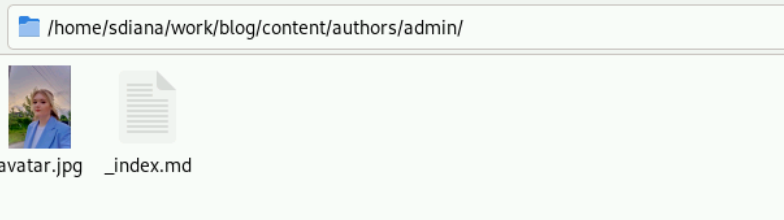{#fig:001 width=90%}

В том же каталоге начинаем редактировать личную информацию в файле _index.md (рис. [-@fig:002]).

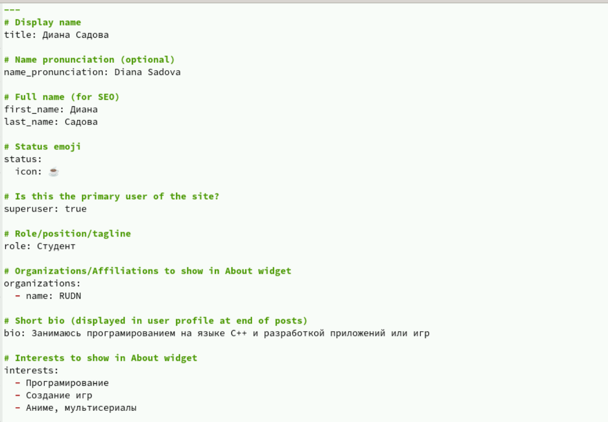{#fig:002 width=90%}

Проверяем как это выглядит на сайте запустив hugo server (рис. [-@fig:003]),(рис. [-@fig:004]).

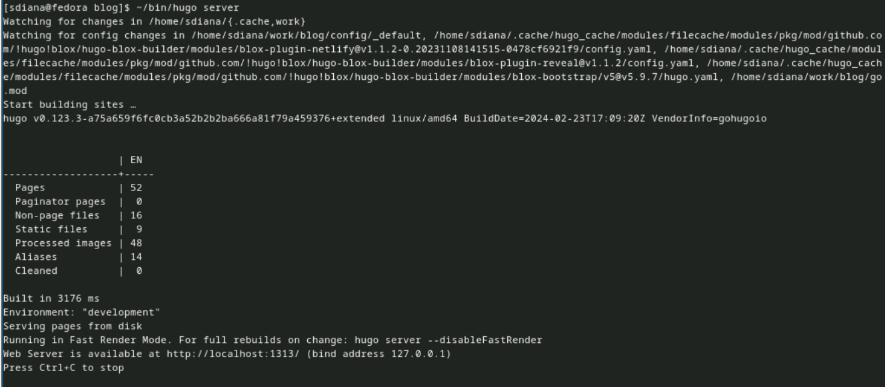{#fig:003 width=90%}

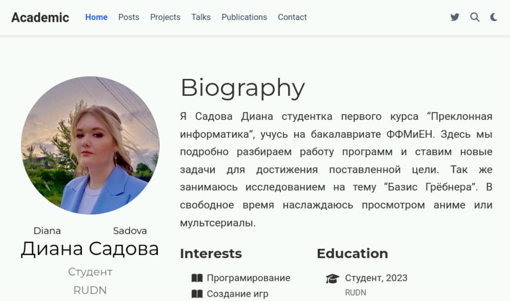{#fig:004 width=90%}

Вторым пунктом индивидуального проекта идет создать пост по прошедшей неделе (рис. [-@fig:005]),(рис. [-@fig:006]),(рис. [-@fig:007]).

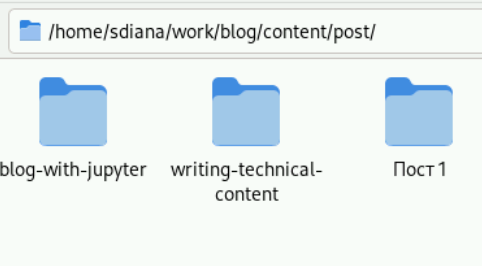{#fig:005 width=90%}

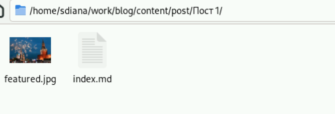{#fig:006 width=90%}

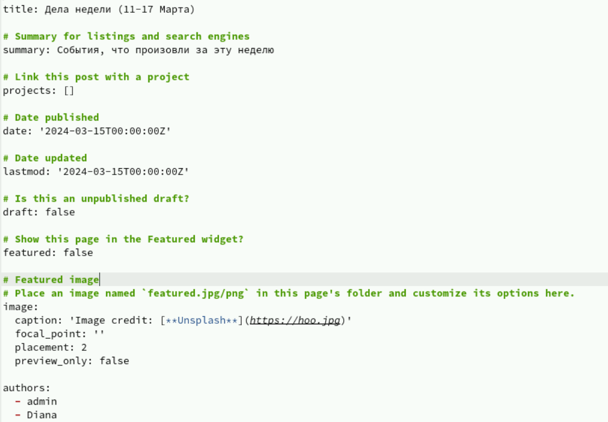{#fig:007 width=90%}

Проверяем как это выглядит на нашем сайте (рис. [-@fig:008]),(рис. [-@fig:009]).

{#fig:008 width=90%}

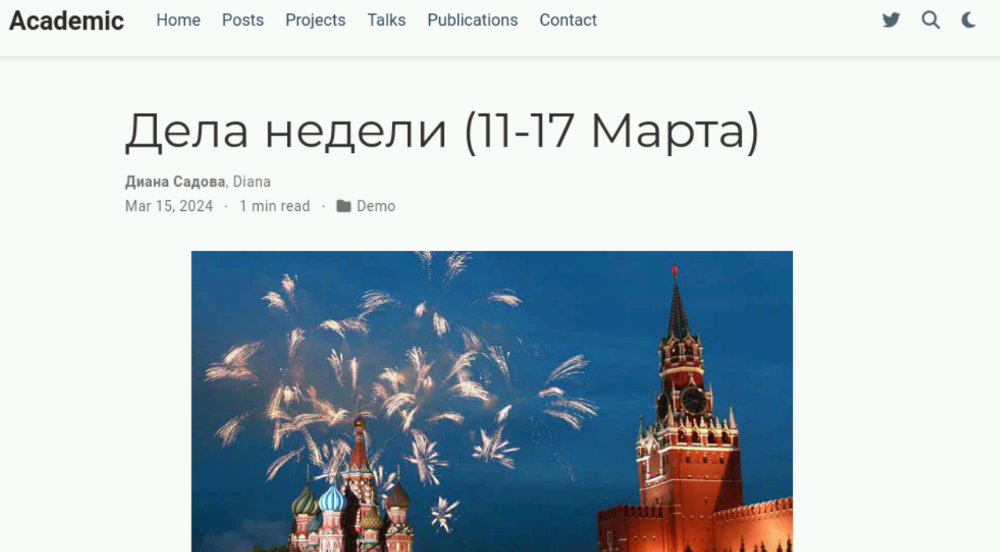{#fig:009 width=90%}

Заключительным пунктом индивидуального проекта идет создание поста на выбранную тему. Моя тема была "Управление версиями. Git." (рис. [-@fig:010]),(рис. [-@fig:011]),(рис. [-@fig:012]).

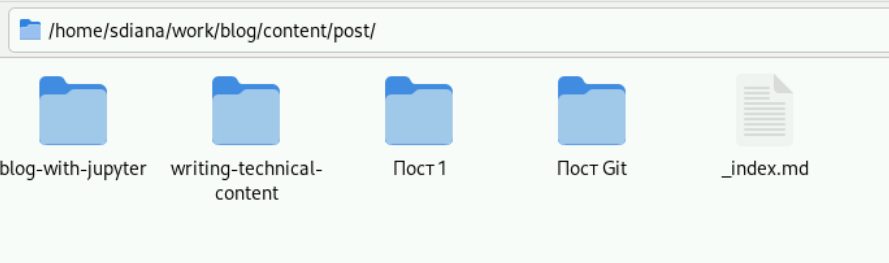{#fig:010 width=90%}

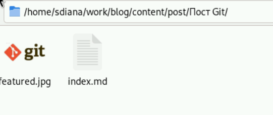{#fig:011 width=90%}

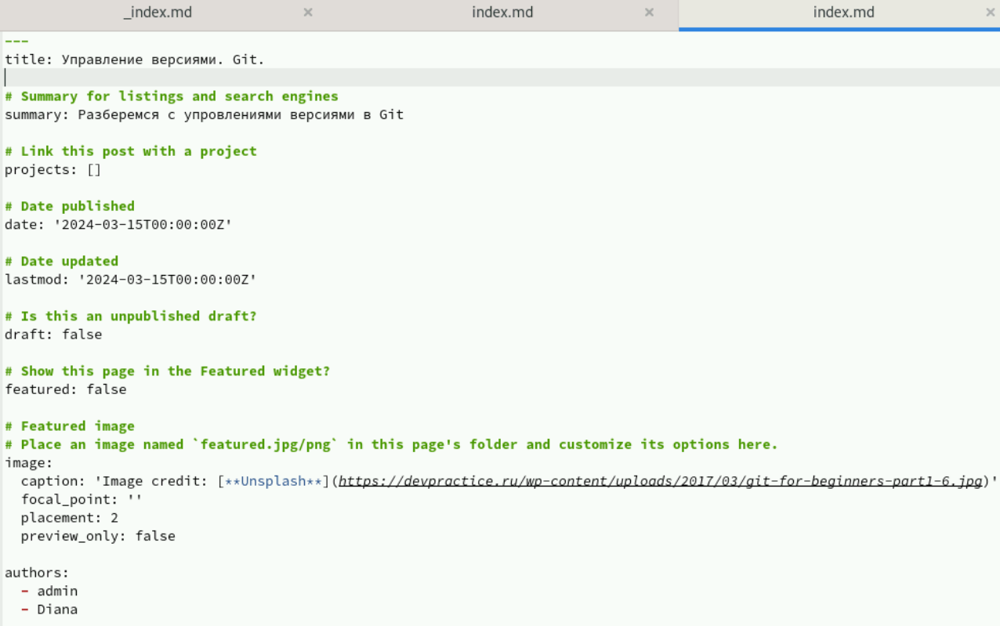{#fig:012 width=90%}

Проверяем как это выглядит на сайте (рис. [-@fig:013]),(рис. [-@fig:014]).

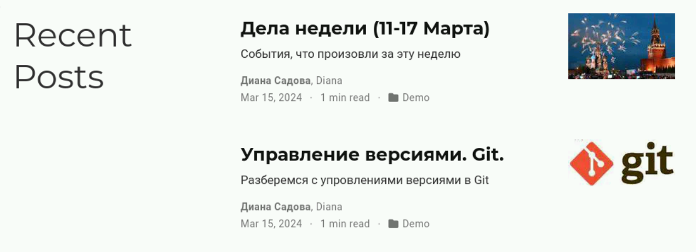{#fig:013 width=90%}

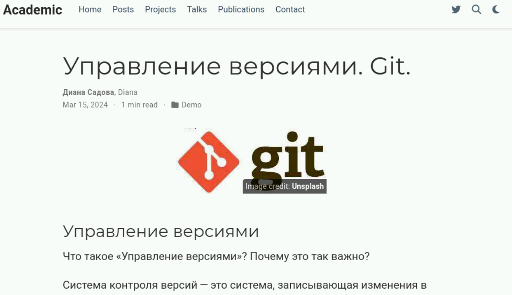{#fig:014 width=90%}

Чтобы переместить всю созданную нами информацию на наш личный сайт, нужно все отправить на репридиторий blog и репридиторий личного сайта (рис. [-@fig:015]),(рис. [-@fig:016]).

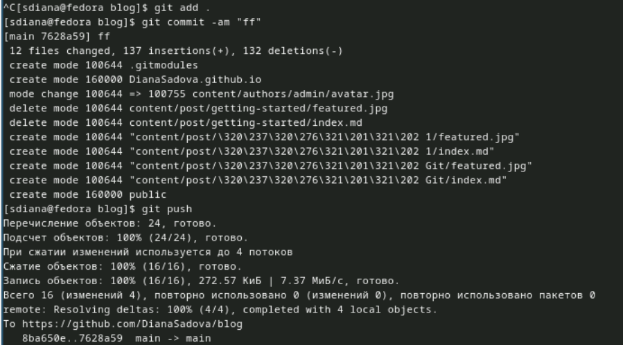{#fig:015 width=90%}

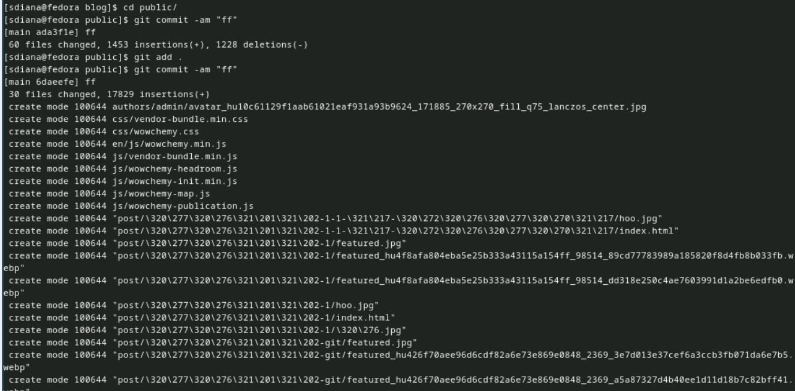{#fig:016 width=90%}

Переходим в репридиторий личного сайта для проверки, что все установилось усаапешно и далле переходим на сам сайт (рис. [-@fig:017]),(рис. [-@fig:018]).

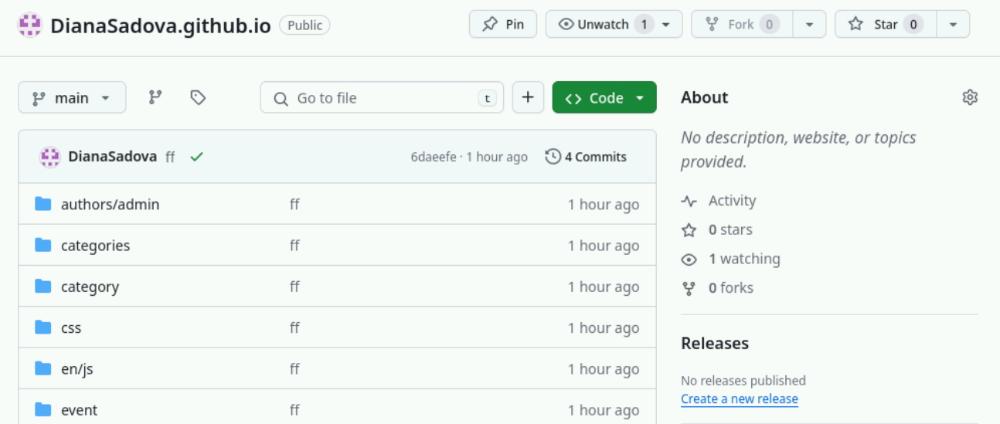{#fig:017 width=90%}

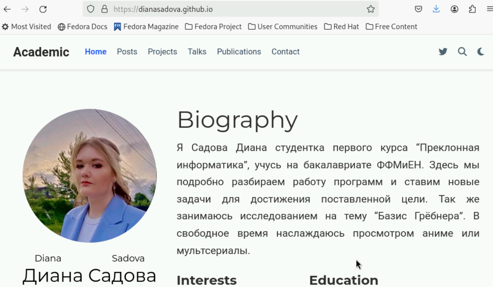{#fig:018 width=90%}

# Выводы

Выполнили работу по теме "Индивидуальный проект. Этап 2". Узнали как работать с информацией на сайте.

# Список литературы{.unnumbered}

::: {#refs}
:::
