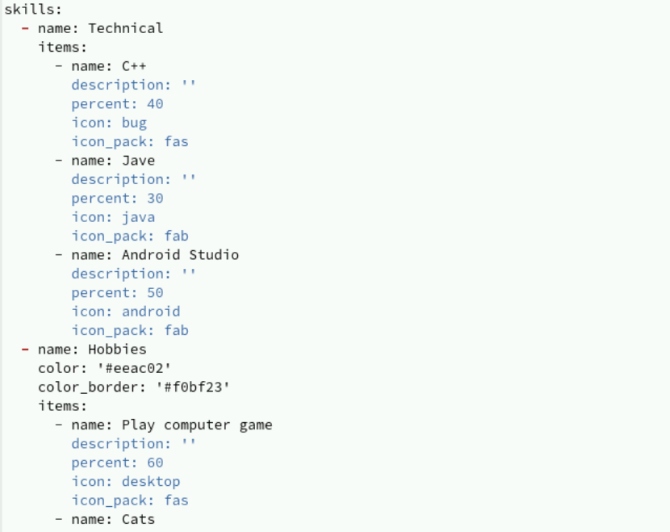
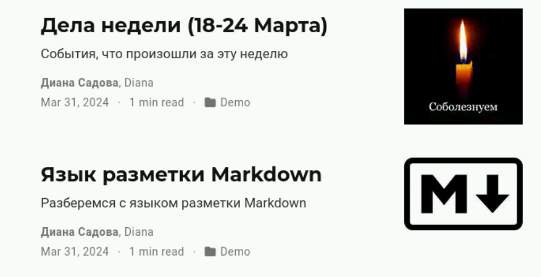

---
## Front matter
title: "Отчёт о выполнении. Индивидуальный проект. Этап 2"
subtitle: "Простейший вариант"
author: "Диана Садова Алексеевна"

## Generic otions
lang: ru-RU
toc-title: "Содержание"

## Bibliography
bibliography: bib/cite.bib
csl: pandoc/csl/gost-r-7-0-5-2008-numeric.csl

## Pdf output format
toc: true # Table of contents
toc-depth: 2
lof: true # List of figures
lot: true # List of tables
fontsize: 12pt
linestretch: 1.5
papersize: a4
documentclass: scrreprt
## I18n polyglossia
polyglossia-lang:
  name: russian
  options:
	- spelling=modern
	- babelshorthands=true
polyglossia-otherlangs:
  name: english
## I18n babel
babel-lang: russian
babel-otherlangs: english
## Fonts
mainfont: PT Serif
romanfont: PT Serif
sansfont: PT Sans
monofont: PT Mono
mainfontoptions: Ligatures=TeX
romanfontoptions: Ligatures=TeX
sansfontoptions: Ligatures=TeX,Scale=MatchLowercase
monofontoptions: Scale=MatchLowercase,Scale=0.9
## Biblatex
biblatex: true
biblio-style: "gost-numeric"
biblatexoptions:
  - parentracker=true
  - backend=biber
  - hyperref=auto
  - language=auto
  - autolang=other*
  - citestyle=gost-numeric
## Pandoc-crossref LaTeX customization
figureTitle: "Рис."
tableTitle: "Таблица"
listingTitle: "Листинг"
lofTitle: "Список иллюстраций"
lotTitle: "Список таблиц"
lolTitle: "Листинги"
## Misc options
indent: true
header-includes:
  - \usepackage{indentfirst}
  - \usepackage{float} # keep figures where there are in the text
  - \floatplacement{figure}{H} # keep figures where there are in the text
---

# Цель работы

Выполнить работу по теме "Индивидуальный проект. Этап 3"

# Задание

Добавить к сайту достижения.

    1)Список достижений.
    
        1)Добавить информацию о навыках (Skills).
        2)Добавить информацию об опыте (Experience).
        3)Добавить информацию о достижениях (Accomplishments).
        
    2)Сделать пост по прошедшей неделе.
    
    3)Добавить пост на тему по выбору: 
    
        Легковесные языки разметки.
        Языки разметки. LaTeX.
        Язык разметки Markdown.

# Выполнение лабораторной работы

Переходим в папку blog/content где и продолжим нашу работу. 

Для выполнения первого пункта работы, мы добавим информацию о навыках (Skills)(рис. [-@fig:001]).

{#fig:001 width=90%}

Проверяем как это выглядит на сайте запустив hugo server (рис. [-@fig:002]),(рис. [-@fig:003]).

{#fig:002 width=90%}

{#fig:003 width=90%}

Далле мы добавим информацию об опыте (Experience)(рис. [-@fig:004]).

{#fig:004 width=90%}

Проверяем как это выглядит на сайте(рис. [-@fig:005]).

{#fig:005 width=90%}

Следом мы добавим информацию о достижениях (Accomplishments)(рис. [-@fig:006]).

{#fig:006 width=90%}

Проверяем как это выглядит на сайте (рис. [-@fig:007]).

{#fig:007 width=90%}

Вторым пунктом индивидуального проекта идет создать пост по прошедшей неделе (рис. [-@fig:008]),(рис. [-@fig:009]).

{#fig:008 width=90%}

{#fig:009 width=90%}

Проверяем как это выглядит на нашем сайте (рис. [-@fig:010]),(рис. [-@fig:011]).

{#fig:010 width=90%}

{#fig:011 width=90%}

Заключительным пунктом индивидуального проекта идет создание поста на выбранную тему. Моя тема была "Язык разметки Markdown." (рис. [-@fig:012]),(рис. [-@fig:013]).

{#fig:012 width=90%}

{#fig:013 width=90%}

Проверяем как это выглядит на сайте (рис. [-@fig:014]),(рис. [-@fig:015]).

{#fig:014 width=90%}

{#fig:015 width=90%}

Чтобы переместить всю созданную нами информацию на наш личный сайт (рис. [-@fig:016])

{#fig:016 width=90%}

Переходим в репридиторий личного сайта для проверки, что все установилось усаапешно и далле переходим на сам сайт (рис. [-@fig:017]),(рис. [-@fig:018]),(рис. [-@fig:019]),(рис. [-@fig:020])

{#fig:017 width=90%}

{#fig:018 width=90%}

{#fig:019 width=90%}

{#fig:020 width=90%}

# Выводы

Выполнили работу по теме "Индивидуальный проект. Этап 3". Узнали как работать с информацией на сайте.

# Список литературы{.unnumbered}

::: {#refs}
:::
